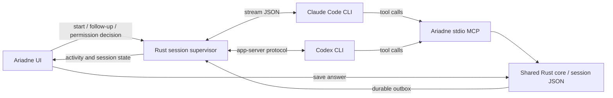

# Managed agent sessions

Decision baseline: **2 October 2026**. Claude Code is the primary integration; Codex is also required for release. This replaces the earlier hook-only proposal and the intermediate MCP-wait/Channels proposal. [Basic Claude two-turn transport has now passed a live test](evidence/CLAUDE_STREAM_SMOKE.md); the full managed integration remains unimplemented and unproved.

Detailed interfaces/algorithms are in [LOW_LEVEL_DESIGN](LOW_LEVEL_DESIGN.md). This document is the overview; read the process, queue and API specifications before implementing adapters.

## The chosen approach

Ariadne launches the user's installed, unmodified agent CLI, keeps its input/output channels open, and manages the conversation. The owner can start a task, answer questions, send follow-ups, review permission requests, stop work, and resume from Ariadne. The task tree remains the main view.

| Responsibility | Claude Code — first implementation | Codex — required second adapter |
| --- | --- | --- |
| Conversation control | Persistent `claude -p` with input/output `stream-json` | Local `codex app-server` over stdio |
| Follow-up or saved answer | Write an attributed user message to the owned process | Start a turn on the bound thread |
| Structured tree changes | Ariadne's local stdio MCP tools | The same Ariadne MCP tools |
| Tool permissions | Claude's permission-prompt MCP tool, with an Ariadne approval card | Reply to app-server permission requests |
| Session continuity | Record CLI session ID; resume it explicitly | Record thread ID; resume it explicitly |
| Authentication | User's CLI configuration and provider-owned login | User's CLI configuration and provider-owned login |

MCP gives the agent tools for updating Ariadne. Session control gives Ariadne a way to send the owner's next input. These are separate interfaces. An MCP notification alone is not the delivery mechanism, and a long-lived question tool is not required to keep the conversation reachable.



## Product boundary

- **Managed sessions:** start or resume through Ariadne. The app owns their process handles and can submit messages automatically. One active managed conversation per project root initially prevents two managed agents editing the same checkout. Separate existing worktrees can run independently; Ariadne does not create worktrees in v1.
- **External terminal sessions:** the optional CLI/plugin/hook integration can still record the tree and fetch answers. Mark these **External session · manual pickup**. They do not satisfy the live-delivery release gate. Ariadne cannot acquire stdin of an arbitrary already-running terminal process.
- **Resume:** resume an Ariadne-recorded host ID after its previous run stops. Importing arbitrary host history, discovering private transcript files, remote sessions, and simultaneous control from a terminal and the app are deferred.
- **Minimal controls:** New session defaults to Claude Code and accepts project, initial prompt, model override if supported, and permission mode. A collapsible **Conversation** panel shows streamed assistant text, tool activity summaries, follow-up input, Stop, and Resume. It shares the existing detail region rather than adding a permanent fourth column. Permission requests remain accessible globally when this panel is closed.
- Window close hides Ariadne and keeps work running. Quit shows active runs and lets the owner cancel quitting or stop them and quit. After explicit Stop, answering another item saves it but does not restart the agent; the UI offers Resume.

## Claude adapter

Use direct process I/O from Rust so the chosen Tauri/Rust stack needs no production Node/Python sidecar. Start with the following protocol flags; the implementation adds validated paths for the generated MCP configuration, rules/plugin, and permission tool:

```text
claude -p --input-format stream-json --output-format stream-json
  --verbose --include-partial-messages --replay-user-messages --permission-mode manual
```

The official CLI documents streaming input, acknowledgment echoes, resume, and a permission-prompt MCP hook. Validate exact message and approval schemas against the supported binary during M0. Use `--resume` with the recorded ID; never rely on “most recent conversation.” [Claude CLI reference](https://code.claude.com/docs/en/cli-reference)

Keep stdin open between turns. Parse initialization, assistant/tool events, echoed user messages, and result/error events. Associate each input with a durable delivery ID; record the host session ID before dispatching follow-ups. A final result closes a turn, not the Ariadne conversation. New owner input starts the next turn. If the supported CLI exits between turns, the adapter may resume the recorded session automatically for a queued input after a **clean** completion; a crash is handled separately below.

Use `--permission-prompt-tool` with a dedicated Ariadne MCP tool. Its handler records a permission request, releases the store lock, and waits for that request's UI decision. The tool itself never grants permission merely because it was called. Default to ordinary prompted permissions; do not use `acceptEdits`, auto approval, or bypass modes as an integration shortcut. Cancellation, deny, timeout, disconnect, and malformed decisions all deny or cancel. Tools with host-specific user-interaction requirements may not be approvable through this mechanism; M0 must prove the supported surface and document denials. Owner questions should use Ariadne's question records.

The TypeScript/Python Agent SDK remains an explicit fallback **only if** the direct CLI cannot provide a required control in the M0 proof. That would add a packaged runtime and require a recorded architecture/authentication decision. Do not silently substitute an SDK or make SDK subscription eligibility a dependency.

## Codex adapter

Use stdio app-server, initialize the connection, then start/resume the bound thread. Submit input with `turn/start`; observe streamed events and completion; return decisions for server-initiated approvals. Its wire format is JSON-RPC shaped but omits the `jsonrpc` field. Use documented interruption for Stop. [Official OpenAI app-server documentation](https://learn.chatgpt.com/docs/app-server)

Use the same queued-after-current-turn behavior as Claude. `turn/steer` is available upstream, but active-turn steering is deferred to avoid giving the two hosts different answer semantics. Map native user-input requests to a request card and return the matching response while that request is live; never leave one pending while trying to start a competing turn. A question already logged through Ariadne MCP must not also be rendered as a duplicate native question.

Capture protocol schemas/fixtures from the tested CLI version. Unsupported protocol versions fail with an actionable compatibility message; they do not fall back to parsing terminal escape sequences. App-server is an evolving upstream integration and remains a version-compatibility risk.

## Rust process ownership

`crates/ariadne-runtime` owns both adapters and their normalized event model. The desktop host starts an internal `ariadne agent-worker` process per managed session; the worker launches the provider CLI, owns its handles/process group, and communicates with the app over private pipes. This is an app-owned helper, not a detached daemon or network service. The installed CLI and worker are built from the same version.

The worker monitors parent-pipe closure. If the app crashes, it stops dispatching, cancels pending approvals, interrupts the child, and performs bounded process-group cleanup. It holds a nonblocking project runtime lease for its lifetime, so a reopened app cannot start a duplicate run during cleanup. Never kill by a saved PID alone. Release the lease only after owned child cleanup. M0 must prove parent death/EOF and child termination behavior on macOS; if cleanup cannot be established, report **Recovery required** instead of launching another writer.

If the worker itself is killed, a released OS lease does not prove its provider child exited. A nonterminal persisted run without confirmed cleanup blocks automatic relaunch. Reconcile with process identity evidence or require deliberate recovery; test this separately from orderly parent-pipe EOF. External tools editing the same checkout are outside the managed lease guarantee.

A lease is distinct from a transaction lock: acquire the lease before opening a run, never wait for a lease while holding a store lock, and acquire only one store transaction lock at a time. Stable lease files, like store locks, are not routinely deleted.

Normalized session states are `starting`, `idle`, `running`, `awaiting_permission`, `stopping`, `stopped`, `failed`, and `recovery_required`. These are process states, separate from item statuses and answer delivery states. UI liveness comes from current process/protocol evidence; persisted state after a crash is not proof of a running process.

Read stdout and stderr concurrently. Parse partial UTF-8/JSON lines across arbitrary pipe chunks, bound frame/buffer sizes, tolerate documented unknown optional events, and reject malformed required frames. Keep protocol output separate from human diagnostics. Apply backpressure to UI activity; retain authoritative domain updates and terminal events. Store bounded redacted diagnostics and concise provenance, not a duplicate full host transcript. Never render raw HTML or hidden reasoning fields from provider events.

## Answer scheduling and recovery

1. Submitting an answer atomically stores the answer, owner message, item transition, and one outbox entry. Only then display **Saved**. Renderer failure after commit cannot lose it.
2. The session worker watches and periodically reconciles the outbox. Only it can dispatch for its bound consumer. While idle, send promptly. While a turn is active, show **Queued · agent busy** and dispatch automatically at its completion. No additional terminal message is needed. A correction follows the same ordering.
3. Ordinary MCP question creation returns promptly. Rules direct the agent to finish independent work and yield the turn when blocked on the owner. Permission/native-input requests use their matching response path; an ordinary answer never counts as tool permission.
4. Before writing to the pipe, persist `sending` with delivery/run IDs and the precise answer IDs. Host acceptance records `accepted`; a pipe write alone does not. The agent acknowledges exact answer IDs through MCP after reading, producing **Received**. An outcome produces **Resolved**.
5. Each owner submission creates one input sequence and one host turn. Never coalesce distinct messages/answers. Send the lowest queued input only after the previous turn completes successfully; host acceptance or answer acknowledgment alone does not advance the queue. Direct follow-ups use this same FIFO. Permission/native-request responses resolve the active request separately.
6. A transport rejection before acceptance can return to `queued` with a reason. A crash between send and acceptance is **uncertain**: neither silently resend nor mark received. On resume, use supported host evidence when available; otherwise show the delivery and offer an explicit resend with the same answer IDs. There is no exactly-once guarantee for arbitrary tool side effects.
7. Host acceptance without an agent receipt stays **Awaiting acknowledgment**. Do not continuously start turns resending it. A later input/resume can remind the agent about previously delivered IDs. Managed fetch never exposes future queued answers before their turn; receipts are non-destructive and idempotent.
8. Stopped, disconnected, authentication-failed, quota-limited, or incompatible hosts leave answers saved. Explain the specific state and offer the corresponding Resume/sign-in/retry action. No unbounded retry loops or automatic provider/model switching.

Target idle dispatch latency: within one second after a durable save on the reference Mac, excluding provider response time. Busy turns and approvals show their actual wait reason. Store polling is not model polling and never starts a turn without owner input queued for that conversation.

Outbox routes distinguish ordinary turns, responses to a live native user-input request, and external-session fetch. A native response uses the matching host request while the turn is blocked; it is never also sent as a new turn. An expired native request leaves its answer saved for review/resume. External entries never launch a managed worker. Acknowledging an answer satisfies its outbox work regardless of whether it arrived through normal dispatch or a recovery fetch, preventing later duplicate sends.

## Permissions and trust

Permission requests carry a run ID, opaque host request ID, tool name, bounded display payload, and expiry/cancellation state. Display the exact requested operation and relevant paths with Allow once / Deny. Do not add persistent broad grants in v1. Write an owner decision atomically and return it only to the still-live matching request. A response lost during a crash expires; a new process must ask again.

Noninteractive Claude sessions can load project settings/hooks without showing the interactive workspace-trust dialog. Require an explicit first-run project trust review in Ariadne before launch; show the configuration sources that will execute. Recheck changed configuration. Keep additional MCP services disabled unless authorized for that project/run. Validate the generated effective configuration and preserve managed host policy. Do not use `--bare` to solve this: its authentication/context behavior differs from normal CLI operation. [Claude programmatic-use documentation](https://code.claude.com/docs/en/headless)

The MCP server is `ariadne mcp serve` over stdio, bound to one project/session/consumer/run by launch configuration. It exposes domain tools and the narrowly scoped permission bridge; it does not expose arbitrary file reads, shell execution, credential access, or frontend code execution. See [CONTRACTS](CONTRACTS.md). No HTTP/WebSocket listener is required in production.

## Authentication, versions, and network boundary

Use the existing installed CLI and its own login/configuration. Ariadne does not read keychain tokens, copy OAuth files, collect a provider password/API key, or implement a “Sign in with Claude” flow. If login is needed, direct the user to the official CLI's login flow. Do not create extra account homes automatically; respect an explicitly configured home.

Record executable path/version, desired provider mode, model, and non-secret configuration references. Show detected credential/provider override **names**, never values. Preserve configured API/cloud use when selected; never silently strip `ANTHROPIC_API_KEY` and claim that guarantees subscription billing. A requested subscription profile with conflicting provider overrides must be resolved before launch. Missing auth and rate limits are actionable session states, not evidence of a broken store.

Anthropic's current policy distinguishes third-party credential intermediation from an end user authenticating the unmodified Claude Code binary. It expressly describes the latter, subject to its terms. That supports this design choice; it does not justify a blanket promise about all SDK uses or subscription billing. [Claude authentication and product conditions](https://code.claude.com/docs/en/legal-and-compliance)

Conductor documents bundled or user-installed Claude Code and CLI-auth/provider choices. That validates the general integration pattern; its public docs do not establish every detail of its internal process protocol. [Conductor harness](https://www.conductor.build/docs/reference/harnesses/claude-code) · [Provider configuration](https://www.conductor.build/docs/guides/providers)

Record tested host versions in M0 and pin parser fixtures/build dependencies. Do not bundle, download, or update the provider CLIs in v1. `doctor` checks the selected executable and supported protocol range before launch. Existing user installation paths may change; rediscovery requires validating the new binary/version.

Ariadne's UI, store, rules and MCP stay local with no analytics, updater, remote assets, or direct model API. Managed provider processes make their normal network calls and may execute their configured tools. Offline tree/history/answer saving works; offline inference does not. No billing or subscription-limit assumption is needed for the data model. The pasted June billing-change reports are not treated as verified facts.

## Required implementation proofs

M0 proves Claude first: two prompts on one session, a question answered solely in Ariadne, busy queue drain, permission allow/deny/cancel, resume, and owned-process cleanup. Then prove the equivalent Codex control surface. M3 delivers the first complete real Claude workflow. M7 proves Codex parity and optional external integrations. See [ROADMAP](ROADMAP.md) for dependencies and evidence gates.

If a required control fails, resolve it before building UI assumptions on top. An external-terminal hook, preview Channel, or indefinitely pending tool is not a substitute for the managed-session acceptance test.
