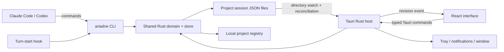

# Architecture and persistence

Status: chosen implementation design, pending the explicitly named platform proofs in the roadmap. No application code has been built. See [DECISIONS](../../DECISIONS.md) for reasons and alternatives.

## System boundaries



The installed product makes no network calls. There is no server, daemon, database service, model API, MCP server, or transcript parser. The app can be closed while agents use the CLI. Native notifications and tray updates operate while the app process runs; closing its window hides it, while **Quit Ariadne** stops it. Reopening reconciles current state without replaying a backlog of notifications.

The agent's own provider traffic and a developer's dependency downloads are outside Ariadne's runtime. External links are displayed with copy actions; Ariadne does not fetch previews or automatically open network URLs.

## Repository and dependencies

```text
Cargo.toml                         # workspace
crates/ariadne-core/               # model, commands, validation, store, registry
crates/ariadne-cli/                # clap commands and hook adapters
apps/desktop/src-tauri/            # Tauri host, watcher, macOS adapters
apps/desktop/src/                  # React / TypeScript UI
packages/agent-rules/              # one canonical rule text
integrations/claude/               # generated plugin, hook manifest, skill
integrations/codex/                # generated instruction block, hook template
fixtures/                         # canonical demo, migration and race cases
tests/                            # process and integration scenarios
scripts/                          # build, install, verification
docs/planning/                    # this plan and acceptance contracts
designs/                          # original archive and extracted reference assets
```

Use the current official Tauri 2 React/TypeScript template at implementation start. Keep its Vite frontend. Choose npm with `package-lock.json` and a Cargo workspace with `Cargo.lock`; commit both. Pin the actual Rust toolchain and Node version used in M0. Record versions after scaffolding instead of guessing compatible patch versions in this plan.

Core crates: `serde`/`serde_json`, `clap`, `thiserror`, `notify`, an OS-backed file-lock implementation, UUID generation for session/operation identifiers, and test-only temporary-directory/property-test utilities. Use plain CSS with extracted design tokens; React context/reducer and pure selectors suffice initially. Graph uses a dedicated React SVG component with a deterministic tree layout, avoiding a full diagram editor dependency. Use inline/local SVG icons. Rust types own the wire model; generate TypeScript DTOs and JSON Schema from those types and check generated files for drift. Validate semantic invariants in Rust, beyond what JSON Schema can express.

Keep platform code in the desktop host and behind a small interface so the store and CLI have no Tauri dependency. This makes race and crash tests fast and leaves future portability possible without implementing other platforms now.

## Files and discovery

```text
<project>/.ariadne/project.json         # immutable project UUID + session metadata
<project>/.ariadne/sessions/<uuid>.json # one authoritative snapshot per session
<project>/.ariadne/locks/<uuid>.lock    # stable lock inode, never rename/delete routinely
<project>/.ariadne/backups/             # last known-good snapshot / migration backups
<project>/.ariadne/setup-manifest.json  # project setup ownership journal
~/.ariadne/projects.json               # rebuildable project-path index
~/.ariadne/preferences.json            # appearance/window/UI preferences
~/.ariadne/integrations/                # installed resources and global setup journal
```

`setup` adds a marked `.ariadne/` entry to the project's `.gitignore`. Project-local storage keeps agent writes inside normal workspace boundaries and makes the history travel with an explicitly moved project. The global registry is an index, not the authority for session contents. Projects are identified by UUID, not basename; store canonical root paths in the registry. Separate worktrees are separate project roots by default.

Project resolution: explicit `--project`, then nearest ancestor containing `.ariadne/project.json`, then Git worktree root for initialization. Non-Git folders are supported through explicit setup. Never scan the whole home directory to discover sessions. Setup and **Add project** register a root; opening a project/session also reconciles its index. Missing roots remain visible as unavailable, with **Locate project** and **Forget from list** actions; forgetting does not delete session data.

Creation commits the session first and updates project metadata/registry afterward. A crash between steps is repaired by enumerating the registered root's `sessions/` directory. Host binding creation is serialized under the project metadata lock; a new, unadvertised random-UUID session file can be created exclusively without taking a second lock. Store the host binding in that snapshot before publishing it, so crash recovery can reuse it rather than creating another session. Registry-write denial must not roll back a committed session: return success with a precise discovery warning, and allow explicit app registration. Agent turn-start hooks do not need to write outside the project.

No cross-file atomicity is assumed. Acquire only one file lock at a time; avoid lock-order deadlocks. Metadata and registry use the same atomic-file discipline as sessions. User UI preferences are independent and cannot invalidate a domain transaction.

## Transaction algorithm

Every mutating entry point, including desktop answers and hook acknowledgments, calls the same core service:

1. Resolve a registered project/session from validated identifiers.
2. Acquire an exclusive advisory lock on the session's stable sibling lock file. Bound the wait to two seconds and return `store_busy` with a retry hint on timeout. Process exit releases OS locks; never infer ownership from a PID file.
3. Read the latest snapshot **after** acquiring the lock; enforce size limits, schema version, structural validation, and semantic invariants.
4. Check the operation's idempotency key and relevant expected item revisions. If the operation was previously committed with the same input, return its prior result. Same key with different input is an error.
5. Apply a domain command to a fresh in-memory snapshot, update backlinks/events, increment session revision once, and validate the complete result.
6. Serialize to a uniquely named temporary file in the same directory, with restrictive permissions. Write completely and sync the file. Preserve the previous valid snapshot through an atomic backup update.
7. Atomically rename the temporary snapshot over the live file, sync the containing directory using the supported macOS mechanism, and release the lock. Report success only after the commit finishes. If post-rename durability fails, return an explicit uncertain-commit error and let the caller query/retry by operation key.

All shipped writers cooperate on this lock. Atomic rename alone does not prevent lost updates. Readers need no lock for a consistent snapshot; they must validate before replacing their displayed state. Concurrent unrelated edits merge through rereading and domain commands; no caller sends a whole replacement snapshot from an old UI cache.

Expected item revisions protect semantic conflicts: an answer made against yesterday's options must not land against new options. Unrelated changes to another item should not reject it. A close command also carries the latest answer sequence it has incorporated; a newly arrived answer prevents premature closure.

The backup protects against accidental damage, not every possible hardware failure. Do not overwrite a malformed live file or silently substitute a backup. Show the last valid in-memory state with a stale-data banner; provide a deliberate `session repair --from-backup` action that preserves the damaged bytes. Unsupported future schemas open as an explanatory error without writes. Migrations run under the same lock, create a versioned backup, and are deterministic; no downgrade or silent reset.

## Model invariants

- Session/project UUIDs identify files. Human-friendly hierarchical item IDs (`1`, `1.1`, `1.1.1`) are allocated under the lock, never reused, and scoped to one session.
- Topics have independent stable IDs and plain-language names. Every item belongs to one topic and has zero or one parent in that topic. Sibling suffixes are monotonic; gaps are allowed. Reparenting and cross-session topic sharing are outside v1.
- Parents and replacements exist in the same session. No parent or replacement cycles, self-links, missing references, duplicate IDs, or duplicate message numbers.
- Seven statuses and five types are exactly those in [PRODUCT](PRODUCT.md). Terminal statuses require nonempty `outcome` and `why`. `replaced` additionally requires a replacement ID and cannot be achieved with a generic status update.
- `waiting_on_me` requires owner `me`, a clear question, and a delivery recipient. Options may be empty for a free-text question; otherwise option IDs are unique and at most one is recommended.
- Every item records its creation message. Item/message backlinks must agree. Messages may touch multiple items; one transaction can create a message and the items it explains.
- Never auto-close children when their parent closes. Preserve status history, answers, and replacement history.
- An answer has an immutable ID/sequence, text or option selection, a copy of the question/options revision it answered, recipient, timestamp, and optional correction reference. Agent receipts are separate from the answer itself.

Provisional v1 bounds: 20 MiB serialized session, 10,000 items, 50,000 messages, depth 32, 4 KiB question/outcome/why each, 16 KiB excerpt/answer, 12 options with 1 KiB label/consequence each, and 32 links per item. Enforce byte limits at command entry and total size before commit. On reaching a limit, explain which limit and how to start another session; never truncate stored content. Validate these choices with stress fixtures before release. Whole-file JSON intentionally prioritizes understandable local state over unlimited history.

## App state and live updates

Rust watches parent directories because atomic rename replaces file inodes. Coalesce bursts for roughly 75 ms, reread/validate, and publish `{session_id, revision}` events. Treat events as invalidation hints, never as the sole record of changes. Reconcile on app focus, wake, watcher error, and a two-second timer while the app runs. Poll registered roots for session additions/removals when native watching misses them.

Frontend startup subscribes first, loads a snapshot second, then compares revisions to catch changes during loading. Ignore older/equal revisions. A selected-session store feeds tree, waiting panel, detail, and graph selectors. Store selection, expanded IDs, filters, and unsent drafts separately from persisted domain state. Reloading state must not reset focus or scroll unexpectedly.

The host maintains lightweight validated summaries for all known sessions to drive tray counts. Missing/malformed sessions show an incomplete-count indicator instead of appearing to have zero waiting items. Selected-session UI reports its own load error. A refresh button and CLI diagnostic provide a recovery path.

## macOS integration

- Use one Tauri application instance. Window close hides it; Cmd+Q / Quit exits. Persist geometry, screen placement, and always-on-top preference; recover offscreen windows after monitor changes.
- Tray uses a template icon and adjacent count title. Its oldest waiting items include project/session names. Include open app, pin toggle, and quit. Cap the menu list with **Show all** while the count remains exact.
- `ariadne open` launches the installed app executable with structured project/session/item arguments. Register Tauri's single-instance plugin first; route arguments to the existing window or queue them until the first window is ready. All navigation sources share one routing function.
- A notification is produced when an item enters waiting while the app runs, including re-entering after new agent information. Deduplicate by item plus waiting-entry revision; coalesce bursts without dropping items from the tray. Initial load and answer-acknowledgment writes do not notify.
- Prove notification click routing in a packaged app during M0. If the stock plugin cannot route macOS clicks, implement a minimal Rust/Objective-C bridge using Apple's UserNotifications delegate and notification payload IDs. Choose one notification owner to avoid competing delegates. This is required work, not a dropped feature.
- Ask notification permission through the app's normal first-use flow. Denial leaves the waiting panel and tray fully usable. Default native text can say a project has a question; full question previews are an explicit preference.

## Local security and privacy

The owner explicitly authorized proceeding without the review tool on 1 October 2026. **Organization security guidance was not fetched or checked.** The following are project design decisions, not a claim of the review tool compliance.

- Treat agent-written files, hook stdin, question text, links, and answers as untrusted input. Render text through React escaping; no raw HTML, injected scripts, remote images/fonts, or automatic URL fetches.
- Bundle assets and apply a restrictive production CSP allowing only Tauri's required IPC and bundled resources. Development hot reload permissions and test automation listeners must not ship in release builds.
- Expose narrowly typed Tauri domain commands; no frontend arbitrary filesystem or shell execution. Resolve session IDs to backend-owned registered paths rather than accepting a write path from the renderer.
- Create `.ariadne` directories with owner-only permissions and data files with owner-read/write permissions where supported. Validate path components and reject symlinked session/lock/temporary targets; canonicalize project roots and verify resolved operations remain contained. Do not claim protection against an attacker already controlling the same OS account.
- Invoke programs with argument arrays; hook setup must safely quote executable paths containing spaces. Never interpolate answer text into a shell command. No downloaded runtime scripts.
- Store only agent-supplied excerpts required for provenance, not complete host transcripts. Do not log raw hook payloads or answer bodies by default. History persists locally until explicitly removed; uninstall preserves it.
- Shared rules tell the agent that answers are attributed owner input scoped to an item. They do not grant permissions or override higher-priority host instructions.
- No auto-updater, analytics SDK, remote crash reporter, notification push service, or production HTTP listener. Verify release behavior offline and inspect the bundle for test-only services.
