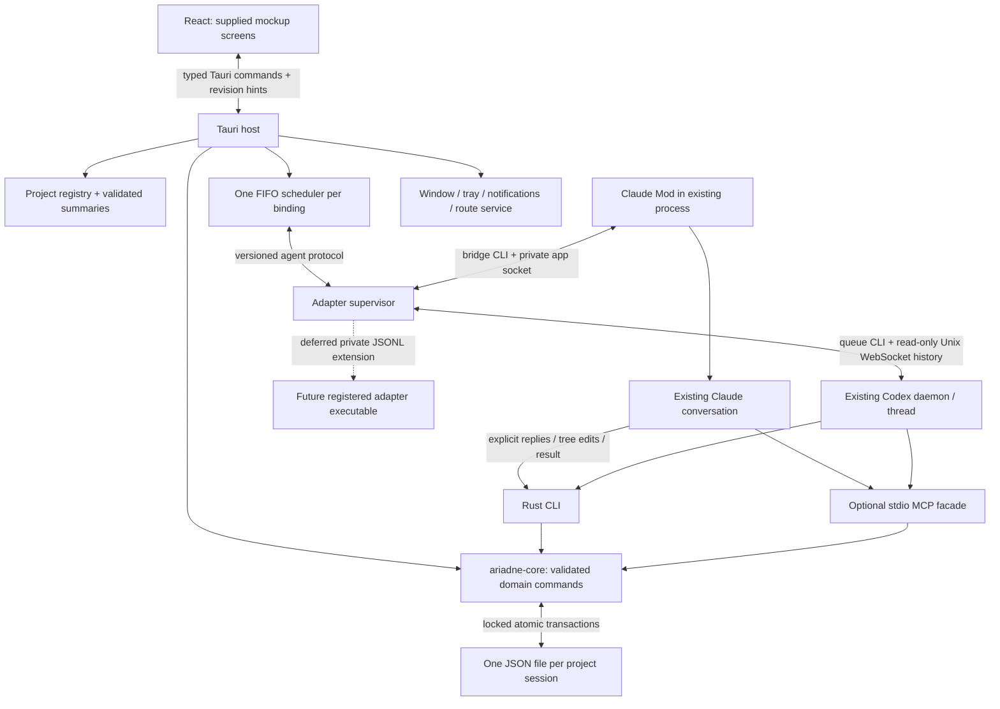

# Ariadne architecture — implementation baseline

**First-release scope:** [Personal release decisions](PERSONAL_RELEASE.md) and
[commit quality checks](DEVELOPMENT_CHECKS.md) govern what ships now. Public
plugin installation and exotic-failure recovery are deferred; organized crates,
discovery/liveness and optimized graphs remain required.

Revision 3 · 2 October 2026. Planned product; two existing-session transport POCs
have passed. [Build handoff](BUILD_HANDOFF.md) is the implementation entry point.
[Design traceability](DESIGN_TRACEABILITY.md) maps the supplied screens to work.
This revision replaces the earlier managed-process architecture in place.

## Product boundary

Ariadne is a local macOS Tauri 2 app and Rust CLI sharing a versioned JSON store.
It adds a structured tree and complete item conversations to **existing** coding
sessions. Claude Code is primary; Codex is equally required. No model client,
provider credentials, terminal emulator, transcription service, or cloud backend
is embedded. Ordinary provider inference/networking remains the user's host's
responsibility. Ariadne uses local files, pipes and Unix-domain sockets only.

## Two independent contracts

**Transport:** app outbox → adapter → existing conversation; adapter reports
acceptance, matching turn, outcome and presence. Captured host final text is
bounded diagnostic activity, never an automatic item reply.

**Domain:** agent calls CLI/MCP with explicit binding, operation and input/attempt
IDs to publish full item replies, statuses, topics and children. The core
validates and commits. UI reads that same committed state. Neither prose parsing
nor model-written IDs alone establish a session binding.

A message is handled after **both** a committed structured result and a successful
matching host turn. A result may create more questions; handled does not mean the
item is closed. Missing results, interrupted turns and uncertain sends stop that
binding's FIFO pending reconciliation. See [queue algorithm](low-level/QUEUES_AND_RECOVERY.md).

## Ownership and implementation map

| Module / planned path | Owns | Does not own |
|---|---|---|
| `crates/ariadne-domain` | serde models, IDs, invariants, pure transitions | IO, provider enums |
| `crates/ariadne-store` | locks, atomic JSON, registry, schema-version checks | agent scheduling |
| `crates/ariadne-core` | commands, authorization by local actor scope, receipts, queries, result/turn join | renderer/provider protocol |
| `crates/ariadne-agent-protocol` | adapter DTOs, capabilities, normalized events | host-specific formats |
| `crates/ariadne-runtime` | supervisor, per-binding lease, dispatch, event reconciliation, local control socket | domain text inference |
| `crates/ariadne-adapter-claude` + `integrations/claude` | Mod bridge translations and resources | permissions or ownership of Claude |
| `crates/ariadne-adapter-codex` | native queue sender + daemon history observer | daemon startup, resume, tool approvals |
| `crates/ariadne-cli` | thin `ariadne` binary: clap public commands, internal bridge, MCP alias | alternate storage implementation |
| `crates/ariadne-mcp` | shared rmcp transport library + thin `ariadne-mcp` stdio binary | business rules, separate persistence |
| `apps/desktop/src-tauri` | Tauri commands, lifecycle, watchers, native service | duplicate business rules |
| `apps/desktop/src` | React components, selectors, drafts, navigation | filesystem/provider access |

Use serde + serde_json, UUID, chrono UTC, sha2, thiserror, fs2 advisory locks,
notify directory watching, Tokio runtime, clap CLI, schemars JSON Schema and
ts-rs TypeScript generation. Use tungstenite over UnixStream for Codex framing;
retain the Python POC as a fixture/reference, not a production dependency.
Use the official Rust MCP SDK (`rmcp`) for its stdio framing/tools wrapper.
Use one root Cargo workspace, resolver 2, workspace dependencies and Cargo.lock;
the three entry points are the Tauri app, `ariadne`, and `ariadne-mcp`. Both MCP
entry commands call the same `ariadne_mcp::serve_stdio()` library function.
The Vite React/TypeScript frontend lives in the desktop npm workspace. Keep
validation/transitions/transactions out of Tauri handlers and transport wrappers.
Codex wire DTOs are generated from the pinned host's JSON Schema with typify;
they remain private to its adapter. See the linked protocol-generation recipe in PROCESS_AND_PROTOCOLS section 6.
Dependency resolution and exact lockfiles are a mechanical M0 task; see handoff.
The P0.2 scaffold stages these boundaries under
[ADR-0009](../adr/ADR-0009-stage-truthful-cli-entrypoints.md): seven domain/provider
libraries are comment-only compiling packages, and the CLI/MCP binaries expose
truthful help/version with nonzero unsupported/unimplemented requests. A scaffold
`ariadne mcp serve` or `ariadne-mcp` invocation must not claim a working MCP service.
The final shared `serve_stdio()`/rmcp boundary above is implemented by its service
task, with the same core/store ownership rather than alternate business logic.
CSS modules + source design variables, React reducer/context, SVG graph; no
remote fonts, UI framework redesign, graph service, Redux or database required.

Integration maturity is a release constraint: Claude delivery needs the Mod's
active prompt submission API; observational hooks cannot replace it. Codex's
local protocol is version-gated and experimental. The shared store retains the
required JSON snapshots with ordinary concurrency/save checks, not a second JSONL source of truth.
See [protocol compatibility](low-level/PROCESS_AND_PROTOCOLS.md#6-compatibility-and-permissions)
and [storage tradeoff](low-level/DOMAIN_AND_STORAGE.md#storage-format-decision).

## Processes and lifetime

One desktop instance supervises adapters for many sessions, including several
sessions in the same project. Exclusivity is **per binding**, not per project.
Project locks serialize filesystem mutations only. CLI and MCP calls are short
lived or tool-server processes that reuse the same core even when the app is off.

The desktop's private Unix control socket is the only way a Claude Mod claims
new work. No desktop means no new dispatch for either provider. Closing the
window hides to tray; Quit stops dispatch and its own workers, but never kills,
interrupts, resumes or changes permissions of an external host. Already delivered
work may finish and commit domain data while the app is closed. Claude lifecycle
reports persist through the CLI; Codex reconciliation reads host history on reopen.

## Storage, trust and failure boundaries

Canonical data is `~/.ariadne/projects/<project-id>/sessions/<uuid>.json`, with
project identity, locks and backups beside it; nothing is written into the project
folder ([ADR-0082](../adr/ADR-0082-project-store-under-data-root.md)). The data
root also holds project registration,
first-party adapter configuration, UI preferences, binding index and private
runtime files. Project roots are explicit or registered by a connection; no
private transcript crawler. Global indexes are rebuildable from known registered session files, not the sole copy of
session history. [Storage algorithms](low-level/DOMAIN_AND_STORAGE.md).

The local OS account is the trust boundary. Binding handles prevent accidental
cross-session routing, not malicious access by programs already running as that
user. Validate scope and generations on every write. No remote API, automatic
plugin downloads, token copying, HTML execution, hidden-reasoning capture, raw
transcript imports or default payload logs. Desktop commands never accept an
arbitrary write path; registered IDs resolve to validated roots.

First-party adapters and an in-process fake share a Rust interface and DTOs.
Provider types stay outside core/store/UI. Missing observation capabilities show
qualified states. Public executable registration, plugin loading and a third
executable proof are deferred; the [adapter reference](AGENT_ADAPTERS.md) records
the proposed extension without making it a v1 acceptance gate.

## Design grounding and scope

Implement the actual waiting panel, tabs/project lists, sentence-based tree,
item detail, rounds/forks, message rail, graph, owner actions and edge states.
Archive/close are guarded against hiding unresolved work. Continue creates a
provenance-linked snapshot copy, not a cross-file shared mutable topic. Exact
source-to-component mapping and intentional differences are in [DESIGN](DESIGN.md).

Hooks complement host-state reads and periodic heartbeats: lifecycle events say
what happened, heartbeat says the bridge is still reachable. Neither a PID nor
an open MCP pipe alone means the model is running. Discovery/presence is included;
known-session manual connection satisfies the primary workflow.

## Evidence boundary

Live: Claude Code 2.1.287 Mod delivery/hooks; Codex 0.160.0 queue plus history; each
completed three ordered same-session turns including busy submissions and context
recall. Production domain results, storage, native packaging and recovery are
specified below but unimplemented. No architecture decision depends on a future
choice between unresearched transports. Compatibility tests have fixed inputs,
expected outcomes and failure policy in [VERIFICATION](low-level/VERIFICATION.md).

Organization security guidance was not checked under the owner's the review tool waiver.
