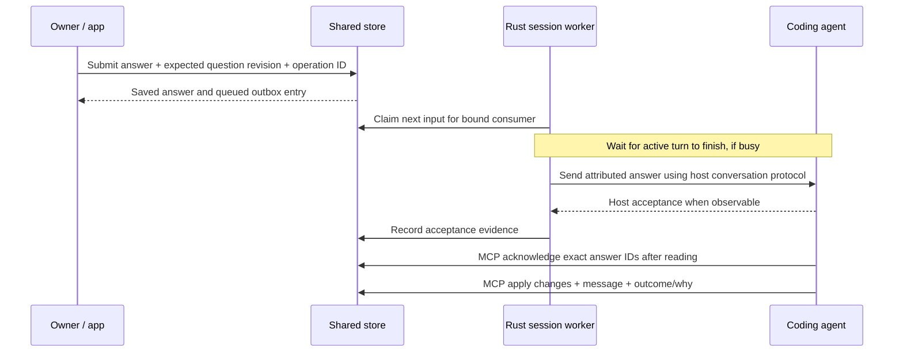

# Data, command, and answer contracts

This is the contract overview. Exhaustive fields/algorithms are in [Domain and storage](low-level/DOMAIN_AND_STORAGE.md), [API and MCP](low-level/API_AND_MCP.md), and [Queues and recovery](low-level/QUEUES_AND_RECOVERY.md). Examples specify intended interfaces, not commands available today.

## Session schema v1

| Entity | Required fields and semantics |
| --- | --- |
| Session | `schema_version: 1`, `id`, `project_id`, `title`, `revision`, `created_at`, `updated_at`, `counters`, `topics`, `items`, `messages`, `answers`, `consumers`, `runs`, `outbox`, `host_requests`, `operation_receipts` |
| Topic | `id`, `name`, `order`, `created_at`; exists in one session |
| Item | `id`, `topic_id`, `parent: null\|id`, `question`, `type`, `status`, `owner`, `created_at`, `updated_at`, `revision`, `question_revision`, `next_child`, `created_in_message`, `updated_in_messages`, `links`, `options`, `status_history` |
| Conditional item fields | `outcome`, `why` for terminal states; `replaced_by` for replaced; `waiting_since` and `recipient_consumer_id` for waiting; `last_answer_seq` when answered |
| Owner | Tagged value `me`, `agent` with consumer ID, or `other` with display name; ownership is independent of who created an item |
| Option | Stable item-local `id`, `label`, `consequence`, `recommended: boolean` |
| Link | `kind: pr\|file\|doc`, `label`, `target` (display/copy only in v1) |
| Message | Monotonic `number`, `author: me\|agent`, optional `consumer_id`, `timestamp`, `excerpt`, `items_touched` |
| Answer | Monotonic `seq`, UUID `id`, `item_id`, `question_revision`, copied question/options, `selected_option_id?`, `text?`, `recipient_consumer_id`, `created_at`, `message_number`, `supersedes_answer_id?` |
| Consumer | `id`, `agent: claude\|codex`, `mode: managed\|external`, host session/thread identifier (unset until initialization), optional human label, `created_at`, `last_seen_at`, issued and acknowledged answer sequences |
| Run | UUID `id`, `consumer_id`, executable path/version, non-secret launch profile reference, host conversation ID, process state, start/end time and terminal reason; persisted process state is historical after disconnect |
| Outbox entry | UUID `id`, `consumer_id`, `kind: answers\|prompt`, `route: turn\|host_response\|external_fetch`, request/run ID when relevant, monotonic `input_seq`, answer IDs or prompt, `dispatch_status`, independent `turn_status`, attempts and completion evidence; one entry/turn per ordinary submission |
| Send attempt | UUID `id`, `run_id`, exact payload digest/answer IDs, prepared time, accepted time/reference if proven, rejection/uncertainty reason; retain attempts rather than overwriting uncertainty |
| Host request | Local UUID plus opaque provider ID/run/epoch, `kind: permission\|user_input`, bounded display data, ordered native questions linked to item/answer IDs, `pending\|decided\|returned\|expired`, owner response/time and return evidence; native groups submit atomically |
| Status history entry | Previous/new status, time, message number, previous outcome/why when applicable; immutable |
| Operation receipt | Client operation key, canonical input digest, resulting IDs/revision; persistent for the session lifetime |

All timestamps are RFC 3339 UTC; UI renders local time. Session revision gives total transaction order; message number gives provenance order; answer sequence gives delivery order. Timestamp ties never determine correctness. Item IDs are hierarchical agent references, not filesystem paths. An answer requires a valid selected option, nonempty text, or both. When both exist, preserve and deliver both explicitly; the text supplements the choice rather than silently replacing it.

The first schema needs no migration from the prototype's JavaScript data. Build the canonical demo with the same core commands used by the CLI. Produce a validated complete JSON fixture and generated schema in M1.

## Status transitions

| Current | Allowed next state | Required evidence |
| --- | --- | --- |
| open | waiting_on_me / in_progress / decided / done / dropped / replaced | Waiting recipient; terminal outcome/why; replacement target where relevant |
| waiting_on_me | in_progress through answer submission | Owner answer and provenance message atomically recorded |
| waiting_on_me | open / decided / done / dropped / replaced through agent action | Agent message explaining withdrawal/resolution; no unincorporated owner answer |
| in_progress | open / waiting_on_me / decided / done / dropped / replaced | Agent message and required state fields |
| decided / done / dropped | open via explicit `reopen` | Reason and a new message; preserve prior terminal outcome in history |
| replaced | no direct reopening | Follow its replacement or create a new follow-up item |

`decided` records a settled choice; `done` records completed work or an explanation. Type does not force status, although CLI help should suggest useful combinations. Reopening clears the current terminal outcome only after copying it to history. A new question needing different options is a new child or an explicit return to waiting with a revised question; changing the meaning of a previously decided item without history is rejected.

## Command surface

Global flags: `--project PATH`, `--session ID`, `--consumer ID`, `--json`. Mutations accept `--op-id UUID` for safe retries. Complex input uses a JSON object on stdin or a file; never require shell-escaped nested JSON as the primary interface.

| Command family | Contract |
| --- | --- |
| `project list`, `project register PATH` | Known roots and registration; no whole-disk discovery |
| `session new --title TEXT`, `session list`, `session show ID` | Session lifecycle and summary |
| `session use ID` | Sets terminal convenience default in project metadata; does not rebind existing agent consumers |
| `session bind --agent claude\|codex --host-session ID` | Returns a stable consumer/session association; `--session` can explicitly attach to an existing session |
| `topic add --name TEXT` | Creates named top-level grouping |
| `item add --topic ID [--parent ID] --question TEXT --type TYPE` | Creates item; accepts owner/status/options/recipient via input JSON |
| `item update ID`, `item reopen ID --why TEXT` | Validated field patch or explicit reopen; revisions supported |
| `item close ID --status decided\|done --outcome TEXT --why TEXT` | Closes with a readable result and reasoning |
| `item drop ID --outcome TEXT --why TEXT` | Records deliberate abandonment |
| `item replace ID --with NEW_ID --outcome TEXT --why TEXT` | Sets a validated replacement; batch form can create its target atomically |
| `item list [--status ...] [--owner ...] [--topic ...]`, `item show ID` | Queries; `--open` includes all three nonterminal statuses; `--waiting` means waiting_on_me only |
| `message add --excerpt TEXT --items ID,...` | Adds provenance; author defaults to current agent consumer |
| `apply --input FILE` or `apply --stdin` | One atomic message plus multiple item operations, using local refs for new IDs |
| `answer submit ITEM --input FILE`, `answer fetch`, `answer ack --ids ID,...` | Shared UI/CLI answer protocol; fetch is non-destructive |
| `hook claude`, `hook codex` | Read host JSON on stdin; emit only host-compatible context output on stdout |
| `mcp serve` | Local stdio protocol server; requires fixed launch binding; diagnostics only on stderr |
| `setup --agent claude\|codex\|both [--global] [--external-terminal] [--dry-run]` | Default managed-launch resources; opt-in external host files; print exact changes |
| `uninstall [--agent ...] [--global] [--dry-run]` | Reverse integration changes; preserve session history |
| `demo [--project PATH]`, `open [--item ID]` | Seed isolated demo, open/focus app; demo never launches a provider |
| `doctor`, `session validate ID`, `session repair ID --from-backup` | Diagnose store/discovery/integration; deliberate backup recovery |

Simple item mutations take `--message NUMBER` or `--excerpt TEXT`. If no message is supplied, the CLI creates a truthful operation excerpt from the provided item text, rather than leaving provenance missing. `message add` deduplicates touched IDs and updates backlinks. `apply` is the preferred agent path: one call per meaningful reply instead of one process per field.

Example batch:

```json
{
  "op_id": "0e3534dc-6db6-4b0c-9250-f0c0f8621e40",
  "message": {"author": "agent", "excerpt": "I need your choice before removing the duplicate instruction."},
  "operations": [
    {
      "op": "item.add",
      "ref": "duplicate-rule",
      "topic_id": "t2",
      "question": "Should we keep the sub-agent rule only in AGENTS.md?",
      "type": "question",
      "status": "waiting_on_me",
      "owner": {"kind": "me"},
      "recipient_consumer_id": "c1",
      "options": [
        {"id": "only-agents", "label": "Keep it only in AGENTS.md", "consequence": "Remove the duplicated rule from CLAUDE.md.", "recommended": true},
        {"id": "both", "label": "Keep both copies", "consequence": "Leave both instruction files as they are.", "recommended": false}
      ]
    }
  ]
}
```

Each batch is all-or-nothing, with a receipt mapping `ref` to allocated ID. A retry with the same operation ID returns the same mapping without adding another message.

Default stdout is compact line-oriented text: predictable verb/IDs/status plus escaped one-line text, no ANSI unless interactive and explicitly enabled. Empty query: no item lines. With `--json`, stdout is one JSON object (`api_version`, `ok`, `data`, optional `warnings`) even on errors; failures use `{code,message,hint,details}` under `error`. Diagnostic logging goes to stderr. IDs/enum fields are stable; human prose is not a machine contract.

Exit codes: `0` success, `2` usage/validation, `3` unknown project/session/item, `4` conflict or store busy, `5` I/O/corruption/unsupported schema, `6` integration/install failure. Include field paths and corrective examples. A no-answer fetch succeeds with an empty array. Hook adapters deliberately translate internal errors into non-blocking host behavior; they do not reuse ordinary CLI exit codes blindly.

## Managed session and MCP interfaces

Tauri exposes typed `agent_start`, `agent_resume`, `agent_stop`, `agent_send`, `agent_status`, `permission_respond`, `user_input_respond`, and `delivery_resolve` commands. Each resolves backend-owned project/session/run IDs; none accepts an arbitrary shell string or executable from the renderer. New/resumed sessions pass validated launch profiles and project trust. `agent_send` persists the owner prompt and outbox entry before returning. `delivery_resolve` permits explicit resend of an uncertain input or marking it reviewed without claiming agent receipt.

MCP tool names below are Ariadne's application contract; wire names are generated by the selected MCP SDK:

| Tool | Behavior |
| --- | --- |
| `session_read` | Bounded state/query for the launch-bound session; no arbitrary project path |
| `apply` | Same atomic message/item operations, revisions, limits and receipts as CLI apply |
| `answer_fetch` | Non-destructive answers for the launch-bound consumer, with explicit pagination |
| `answer_ack` | Acknowledge exact fully issued IDs; cannot acknowledge another consumer's answers |
| `permission_prompt` | Claude-specific permission bridge: validate host payload, persist request, wait without holding store lock, return only matching live owner decision |

There is no general `send_message` MCP tool: the Rust runtime sends owner input through the agent's conversation protocol. Ordinary domain MCP calls finish promptly. `permission_prompt` is the sole waiting bridge; disconnect/timeout expires the request. Agent domain tools cannot write permission decisions, run state, or outbox acceptance. The same OS account is a trust boundary, not an adversarial multi-tenant sandbox.

No full transcript is required for these contracts. Streamed conversation activity is a bounded runtime view; stored excerpts remain the durable item history. Bound owner prompts to 16 KiB, protocol frames initially to 8 MiB, in-memory activity to 2 MiB per run, and host-request display payloads to 64 KiB. Over-limit protocol input produces an explicit error and stops dispatch; never truncate an operation presented for approval. All persisted fields count toward the session's 20 MiB bound. Verify these provisional limits against M0 host fixtures.

## Session and recipient resolution

An Ariadne session represents one working conversation by default. Allocate its session and consumer before managed launch, then bind the host ID returned by initialization in a transaction. No answer is dispatched before this binding is known. A host's stable session/thread ID binds to exactly one Ariadne session and consumer for the project. Resuming reuses it; a new conversation creates a new Ariadne session unless explicitly attached. UI tab selection never changes routing. Binding lookup/creation is serialized so retries cannot create duplicate sessions. A project runtime lease prevents concurrent managed writers in the same root.

For ordinary terminal commands: explicit session wins, then explicit consumer binding, then project convenience default, then the only session if there is exactly one. If several sessions exist with no unambiguous choice, fail and list the choices; never pick “most recently modified.” Agent rules always use the returned session and consumer IDs explicitly. Hooks receive the host session identifier and working directory; they do not inspect private transcript formats.

Each waiting item has one recipient consumer. Consumers can share a session through explicit CLI binding, but their answer queues remain distinct and only one managed run is allowed per project. Transferring answers between agents or continuing a topic into another session is not automatic in v1. A stopped managed run's answers stay queued for its bound conversation until Resume. External answers remain available through `external_fetch` until acknowledged; they never require or trigger managed Resume.

## Answer delivery: durable dispatch and explicit receipt



Dispatch transitions are `queued → sending → accepted → acknowledged` for answers; prompt delivery finishes at accepted. Independent `turn_status` records execution completion. **Only successful turn completion drains the next FIFO input; host acceptance and answer acknowledgment do not.** Each submission has its own turn; no coalescing. Explicit uncertain/failed/cancelled branches preserve unresolved outcomes. Persist before writing; protocol evidence establishes acceptance. On restart interrupted sending becomes uncertain unless evidence resolves it. Never blindly retry an uncertain send. A pre-execution rejection pauses the queue for explicit retry; retain answer IDs. Missing ack alone never resends an accepted input.

Acknowledgment remains a separate per-answer receipt; once every answer in an entry is acknowledged, mark that entry acknowledged atomically. A recovery/external fetch can lead directly from queued or uncertain to acknowledged. Before dispatch, omit IDs already acknowledged so a fetch race cannot later resend them. External-consumer entries use `external_fetch` and never launch a worker. A native user-input answer uses `host_response`, bound to its request/run; if the request expires, retain the answer and require review/resume rather than quietly starting another turn. Permission decisions have no answer outbox entry.

Fetching does **not** advance a destructive cursor. Managed fetch returns only eligible dispatched/current-input answers, never future queued answers ahead of FIFO order. Until acknowledged, eligible answers may appear on recovery fetch. `answer ack` is idempotent and records receipt, not completion. This gives non-destructive answer availability with deduplicated receipts, not exactly-once external execution.

Fetch pages by sequence with continuation: at most 50 answers/64 KiB of serialized application result per MCP/CLI page. A fixed answer/item/message projection must fit 60 KiB including escaping; validate at mutation time, and page growing item histories/links/backlinks separately. Owner text is ≤16 KiB UTF-8; managed formatted input content is ≤32 KiB before JSON escaping, with a separate 256 KiB cap on the complete serialized outbound frame; external hook context remains 16 KiB. Oversized managed-input answer context is referenced for full fetch, never acknowledged as a preview. Record fully issued IDs before output. Ack verifies consumer/eligibility/issuance. Native input responds only to its live host request and never creates a competing turn.

Submitting records an owner message, answer, outbox entry, change to `in_progress`, and owner `agent` with the designated consumer in one commit. A correction appends a sequence and references the previous answer. Answers remain immutable. The agent includes `handled_through_answer_seq` when closing an answered item; a newer answer rejects closure. UI delivery states distinguish saved, busy queue, host acceptance, agent receipt, uncertainty, and resolution. Item `in_progress` alone does not establish a live agent; current process state and agent activity provide that evidence.

Permission decisions never use `answer submit` or change task ownership/status. They expire when their run/request is no longer live. `permission_respond` requires the exact request ID, run ID, expected request revision, and Allow once/Deny choice. Returning a decision and recording its delivery are distinct; an uncertain permission response is never reused for a different run. See [AGENT_RUNTIME](AGENT_RUNTIME.md) for scheduling, crash handling and authentication.
