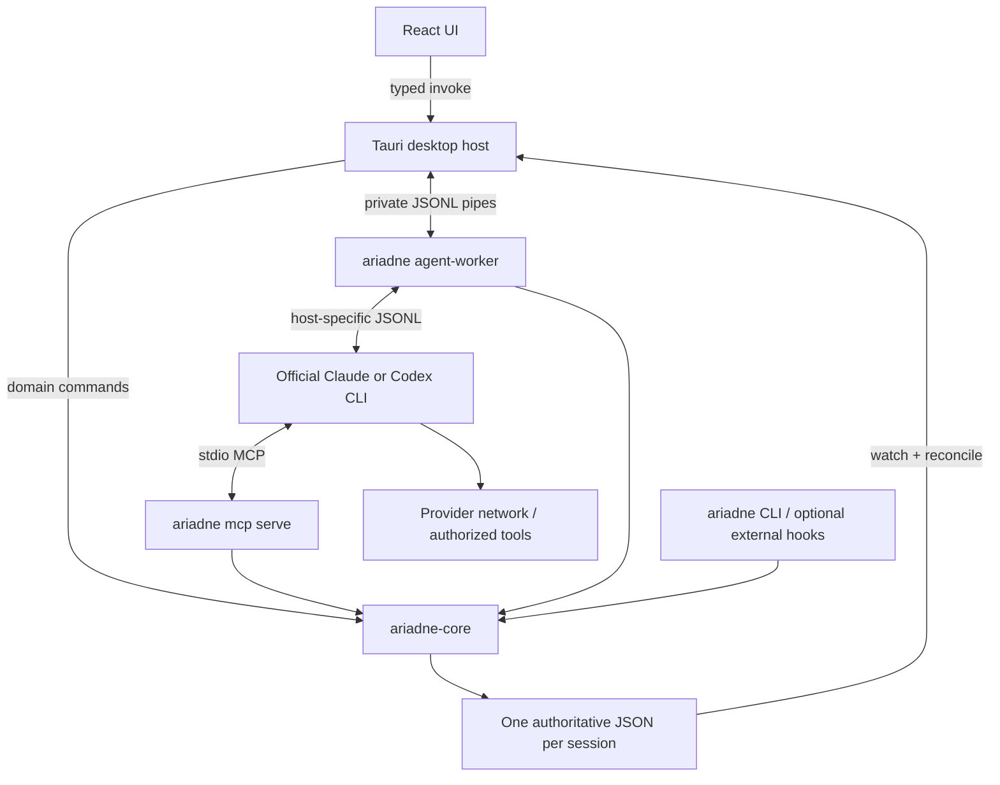

# Ariadne low-level design

Design revision: **2 October 2026**. This is the implementation contract for the planned product. No application has been implemented or live provider integration proved. Earlier statements of “planning complete” overstated the detail available then.

## What this design settles

| Subject | Authoritative low-level specification |
| --- | --- |
| Entities, IDs, changes, locks, snapshots, migrations | [Domain and storage](low-level/DOMAIN_AND_STORAGE.md) |
| Processes, private pipes, Claude and Codex protocols, auth | [Processes and protocols](low-level/PROCESS_AND_PROTOCOLS.md) |
| N-message ordering, answers, permissions, crashes, Stop/Resume | [Queues and recovery](low-level/QUEUES_AND_RECOVERY.md) |
| Rust interfaces, Tauri commands, MCP tools, branching example | [API and MCP](low-level/API_AND_MCP.md) |
| Components, state, selectors, graph, accessibility, macOS | [UI and native behavior](low-level/UI_AND_NATIVE.md) |
| Launch configuration, trust, setup journals, build/install | [Setup and delivery](low-level/SETUP_AND_DELIVERY.md) |
| Required proofs, exact acceptance scenarios, implementation outputs | [Verification](low-level/VERIFICATION.md) |

These specifications refine [PRODUCT](PRODUCT.md), [ARCHITECTURE](ARCHITECTURE.md), [CONTRACTS](CONTRACTS.md), and [AGENT_RUNTIME](AGENT_RUNTIME.md). If an older overview is less specific, use the low-level contract. A genuine contradiction must be fixed in both documents before implementation proceeds. Original user prompts and mockups remain unchanged historical inputs; the user's later integration corrections take precedence.

## System and ownership

Only the provider is an MCP **client**. The React app uses Tauri commands, which call the same Rust services as MCP. There is no MCP hop from the UI and no HTTP service between processes. Permission bridges wait on durable store records outside locks.

| Module | Owns | Must not own |
| --- | --- | --- |
| `ariadne-core` | Domain types, validation, transactions, receipts, project index, answers/outbox/request records | Tauri, provider I/O, model calls |
| `ariadne-runtime` | Worker, adapters, scheduler, protocol parsing, child lifecycle, normalized activity | Item meaning, direct renderer access, credentials |
| `ariadne-mcp` | Tool schemas/dispatch, fixed binding, Claude permission bridge | Arbitrary shell/filesystem tools, owner impersonation |
| `ariadne-cli` | Command parsing, stdout contracts, hooks, internal worker entry point | Alternative validation/store implementation |
| Desktop Rust | UI command authorization, snapshots/watchers, worker pipes, native integration | Provider-specific protocol branches in UI commands |
| React | Rendering, drafts, selection/filtering, explicit owner actions | Authoritative domain state, raw shell/fs access |

## Implementation choices

- Cargo workspace, Rust 2024 edition; Tauri 2 official React/TypeScript + Vite template; npm lockfile. Pin exact compatible patch versions and toolchain when scaffolding; changing a locked dependency later requires a reason and affected checks.
- Rust: `serde`/`serde_json` for storage and frames, `thiserror` errors, `clap` CLI, `tokio` process/pipes/timers, `notify` directory events, `uuid` v4 identities, `sha2` input digests, `tracing` structured diagnostics, `libc` through a small macOS OS module for file locks/process groups/no-follow opens. Avoid a second competing lock library.
- MCP: official Rust `rmcp`, server/stdio features only. Negotiate a protocol version supported by the client; use ordinary tools and cancellation, without depending on newer task/subscription features. [Official Rust SDK](https://github.com/modelcontextprotocol/rust-sdk)
- DTOs: Rust is the implementation authority; `schemars` emits JSON Schema and `ts-rs` emits TypeScript. Serialize collections/counters explicitly as described in the domain contract. Generated drift fails a check. [Schema generation](https://docs.rs/schemars/latest/schemars/) · [Type generation](https://docs.rs/ts-rs/latest/ts_rs/)
- UI: React context + `useSyncExternalStore` snapshot subscription, pure memoized selectors, plain CSS tokens, local icons/fonts. No Redux, client database, rich-text editor, terminal emulator, or graph framework is needed for the specified surface.
- Testing: Rust unit/process tests, Vitest + React Testing Library for UI, and the documented Tauri WebdriverIO route if the native proof passes. Keep provider fixtures separate from live smoke tests.
- OS scope: local macOS filesystem, APFS/HFS+ project roots. Network-mounted roots are unsupported for managed writes because the lock/durability assumptions are unproved. Multiple existing Git worktrees are independent roots; Ariadne creates none automatically.
- Default model/effort is inherited from each CLI's configured default; no automatic provider/model substitution. One managed run per project root, one provider conversation per Ariadne managed consumer.

## Required end-to-end flows

| Owner intent | Complete path |
| --- | --- |
| Start work | Select/trust project → durable session/input → leased worker → official CLI → initialization/turn → streamed activity and MCP tree records |
| Send N messages | N independent durable entries → FIFO one turn each → wait for each successful turn completion → next input |
| Add two children | Agent MCP `apply` batch → bound actor validation → atomic allocation/save → returned IDs → watcher/revision → tree and queue |
| Answer a waiting item | Validate question revision → answer/message/outbox in one commit → eligible turn → host acceptance → agent ack → eventual outcome |
| Approve a tool | Host request → distinct permission record/card → explicit owner decision → exact live request response; never a task answer |
| Stop/quit | Persist dispatch pause → interrupt current turn → cancel live requests → stop owned children → preserve unsent inputs → explicit Resume |
| Recover after crash | Reconcile worker/process ownership → classify send/turn uncertainty → show evidence → explicit recovery → resume same host ID |
| Work offline | Browse/search history, create demo, save answers; provider failure leaves a paused, explainable queue |

The details below define these paths, including what happens between steps. The implementation is not finished when only the happy path works.

## Evidence boundary

Application behavior, data layout, FIFO rules, APIs, component ownership and failure policy are decisions made here. External host schemas can be inspected without inference; their live behavior, permission flow, resume fidelity, and packaged macOS behavior require execution. Those are named proof cases in [Verification](low-level/VERIFICATION.md), with explicit pass/fail actions. They are not an unspecified “figure out integration later” milestone.

The user's prior the review tool waiver remains in effect: **organization security guidance was not fetched or checked**. Local security decisions in this design are not presented as organization-approved standards.
