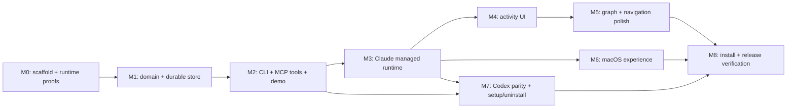

# Implementation roadmap

**Planning complete; implementation not started.** Checkboxes below describe future work. Read [PRODUCT](PRODUCT.md), [AGENT_RUNTIME](AGENT_RUNTIME.md), [ARCHITECTURE](ARCHITECTURE.md), [CONTRACTS](CONTRACTS.md), [DESIGN](DESIGN.md), and [INTEGRATIONS](INTEGRATIONS.md) before changing a contract. Record significant changes in [DECISIONS](../../DECISIONS.md).

## Build sequence

Default execution is one ordered implementation stream. The dependency graph shows where future delegation could be safe; it does not require parallel agents. Complete the core store/command contract before multiple contributors consume it. Each milestone ends in a demonstrable result and a small local commit series. Do not create a remote or publish.

Rough sizing for an experienced engineer using agents: M0 3–5 focused days; M1 4–6; M2 3–5; M3 5–8; M4 4–6; M5 2–4; M6 3–5; M7 6–9; M8 3–5. Total 33–53 focused days before contingency. These are planning estimates, not elapsed-time promises for autonomous runs. Runtime lifecycle, approval handling, crash-safe answer delivery, and host version differences are the largest uncertainties. Re-estimate after M0, M3, and M7; preserve completion criteria when adjusting sequencing.

## M0 — Scaffold and retire platform uncertainty

**Deliverable:** a minimal packaged app/CLI skeleton, extracted design references, and written proof results for both owned provider runtimes. **Depends on:** this plan.

- [ ] **P0.1** Check current official Tauri docs/releases again, scaffold React + TypeScript from the official template, establish workspace/package scripts, pin toolchains and lockfiles. Record macOS deployment target, CPU architecture, host versions, and reference hardware.
- [ ] **P0.2** Extract the mockup ZIP into a reference-only directory with checksums. Map CSS/tokens/components; package font/icon licenses and remove network imports from production assets.
- [ ] **P0.3** Prove a minimal packaged macOS notification opens a named item route, with the window visible, hidden, and app relaunched after a delivered notification. Test denied permission. If the Tauri plugin cannot provide routing, implement the minimal native delegate adapter now.
- [ ] **P0.4** Prove dynamic tray title/count, single-instance launch argument forwarding, window focus, and always-on-top on the target Mac.
- [ ] **P0.5** Prove the persistent Claude `-p` stream-json child lifecycle from launch through initial prompt, multiple turns, idle answer delivery, Stop/Resume, permission-prompt MCP tool UI, and parent-pipe EOF/owned-child cleanup. Use harmless fixed prompts; exercise allow, deny, and cancel.
- [ ] **P0.6** Prove the owned local Codex stdio app-server handshake, thread/turn lifecycle, approval requests, and Stop/Resume. Pin the supported version for fixtures; do not assume hook availability.
- [ ] **P0.7** Prove the documented WebdriverIO embedded macOS route in a dedicated test build. Verify an ordinary release build excludes the driver plugin/listener. If it is impractical in this environment, choose the permitted mocked-frontend route and record precisely which native checks stay manual.

**Gate (mandatory before M1):** evidence records Claude multi-turn stream-json, permission allow/deny/cancel, idle answer wake and resume; Codex app-server handshake/thread/turn/approval behavior; macOS launch/notification routing and chosen test driver. Unknowns have concrete outcomes or an implementation fallback. Do not make model calls during planning; implementation-stage M0 proofs use the version-pinned real hosts in scratch sessions with fixed harmless prompts, plus fixtures for failure paths. No polished UI work should hide unresolved required platform capabilities.

**Suggested commits:** `chore: scaffold Tauri and Rust workspace`; `test: prove macOS and provider runtime protocols`; `docs: record platform baselines`.

## M1 — Domain model and durable shared store

**Deliverable:** a platform-independent Rust core with reliable state transitions and one durable source of truth for agent runtime state. **Depends on:** M0.

- [ ] **P1.1** Define Rust DTOs, schema/version handling, all entity relationships, transition commands, and generated TypeScript/JSON Schema. Build canonical model fixtures including normalized explanation and replacement chain.
- [ ] **P1.2** Implement stable-lock read/modify/validate/atomic-write operations, backups, corruption handling, deterministic migrations, operation receipts, and item revision checks.
- [ ] **P1.3** Implement project/session creation, project-local binding, registry reconciliation, root relocation and unavailable-root diagnostics. Ensure registration failures cannot undo a saved session.
- [ ] **P1.4** Implement answers, corrections, recipient-specific fetch/ack, pagination, and protection against closing over a newer answer. Persist answer outbox delivery state, runtime binding, and permission-request state in the same session JSON transaction model; do not create competing authoritative state files.
- [ ] **P1.5** Add the failure tests listed below, including actual child processes sharing the same store and fault injection around commit boundaries.

**Gate:** no lost updates in repeatable multi-process tests; every persisted result validates; retries allocate no duplicate item/message/answer/run; uncertain child dispatch is represented explicitly and is never blindly replayed; malformed/future-schema files remain unchanged; backup recovery preserves damaged input. Core tests run without Tauri or a graphical session.

**Suggested commits:** `feat(core): define session commands and validation`; `feat(store): add atomic locked persistence`; `feat(core): add answer receipts and recovery`.

## M2 — Agent-friendly CLI and canonical demo

**Deliverable:** a CLI and local stdio MCP tool server that exercise all domain behavior before UI complexity. **Depends on:** M1.

- [ ] **P2.1** Implement command families in CONTRACTS, compact text/JSON, stable errors/exits, contextual help, stdin batch input, and operation ID retries.
- [ ] **P2.2** Make mutation/message backlinks automatic and transactional. Implement topic allocation, parent validation, close/drop/replace/reopen, filtering, explicit session/consumer routing, and diagnostic/recovery commands. CLI fetch/recovery remains auxiliary for external sessions; it is not the managed-runtime answer wake path.
- [ ] **P2.3** Implement `demo`, with the exact short-brief scenario plus only documented normalization. Return created session ID and instructions to open it. Repeated demo runs create clearly separate sessions rather than overwriting work.
- [ ] **P2.4** Add CLI integration tests as subprocesses, including quoted text, Unicode, paths with spaces, invalid options, broken stdin, ambiguous sessions, and simultaneous writers.
- [ ] **P2.5** Expose structured Ariadne domain mutations through MCP tools backed by the same Rust service/receipts as the CLI. Author canonical rules and generate managed-session bootstrap artifacts now for M3. Use local stdio transport only; no HTTP listener and no provider-specific duplicate domain logic.

**Gate:** a shell script can create a topic tree, record provenance, submit an owner answer, fetch/ack, close, replace, and reload. A local MCP client proves parity for its permitted agent operations; it cannot impersonate owner answers or permission decisions. `--json` output parses for success and failure. `doctor` explains a missing configuration without modifying it.

**Suggested commits:** `feat(cli): add domain commands and batch input`; `feat(cli): add answer protocol and demo`; `test(cli): cover routing and structured output`.

## M3 — Claude managed runtime and answer loop

**Deliverable:** a Claude Code conversation can be launched, continued, observed, and answered through Ariadne. Claude remains an installed, unmodified child process using its supported persistent `-p` stream-json stdin/stdout mode. **Depends on:** M2 and the M0 Claude proof.

- [ ] **P3.1** Implement the Tauri Rust runtime adapter crate with no Node sidecar: the desktop host starts an internal Rust `ariadne agent-worker` per managed session; that worker owns the Claude child process/stdio pipes, supplies initial and subsequent prompts, parses stream events incrementally, publishes host process status, and persists the session binding. Shut down only Ariadne-owned runs. Never read or copy provider credentials.
- [ ] **P3.2** Build the minimal session-launch and follow-up-prompt flow, simple tree, persistent waiting queue, item detail and answer control, with real host/session/process status and a Conversation panel. Preserve drafts through session switches and unrelated updates.
- [ ] **P3.3** Route child MCP tool calls to structured Ariadne domain operations. Never keep a question mutation/tool call pending for the owner's answer: commit it and return, then deliver the durable session-JSON outbox when the child is idle or automatically after its busy turn ends. This wake path must not depend on a pending tool call, Channels, or hooks. Show delivery status, receipt, and uncertain dispatch distinctly.
- [ ] **P3.4** Add explicit Resume for stopped runs. A crash or uncertain write/dispatch must surface recovery state and require deliberate resolution; never blindly replay an uncertain prompt or create a second active run.
- [ ] **P3.5** Implement permission-prompt MCP tool UI with Allow once, Deny, and Cancel. Keep provider tool approval requests distinct from owner answers and from Ariadne domain writes; bind each decision to the live run/request and record lifecycle state durably.
- [ ] **P3.6** Keep the runtime alive when the window hides. On Quit, let the owner cancel quitting or stop Ariadne-owned runs and quit gracefully; Stop cancels the selected run. Test initial subscription races, partial stream chunks, atomic store replacement, concurrent updates while typing, stale question rejection, outbox retry, and switching sessions with drafts.
- [ ] **P3.7** Implement typed Tauri store commands, project/session discovery, global summaries, snapshot load, directory watching, revision events, focus/wake/error reconciliation, and polling recovery. Prove a CLI/MCP mutation appears without refresh and survives missed watcher events.

**Gate:** an installed Claude CLI completes multiple turns in the same persistent process; MCP changes update the session; allow/deny/cancel behave as proven in M0; a waiting owner answer is stored while busy and sent when idle; sent, received, pending, and uncertain states are understandable after restart. Stop never silently restarts work; Resume is explicit. Host process status comes from the runtime adapter, not guessed UI timers.

**Suggested commits:** `feat(runtime): supervise Claude stream-json sessions`; `feat(mcp): expose Ariadne domain operations`; `feat(ui): add session activity and answer outbox`.

## M4 — Activity panel and visual fidelity

**Deliverable:** the complete second-screen reading, answering, and run-control experience. **Depends on:** M3.

- [ ] **P4.1** Finish Projects, All sessions and session tabs; known-project registration/location; selection, tab close and persistent UI preferences. Use honest host/last-activity labels.
- [ ] **P4.2** Finish tree expansion, active-descendant indicators, full question/outcome rows, selected ancestry, breadcrumb navigation, all badges and replacement links.
- [ ] **P4.3** Finish detail timeline, answer options/consequences, free text, corrections, Sent/Received/Resolved labels, and message/child navigation. Avoid clipping full sentences in the primary tree/detail.
- [ ] **P4.4** Implement search, all status/topic/owner filters, preserved ancestor context, outside-filter reveal, no-results handling, and stable keyboard/focus behavior.
- [ ] **P4.5** Complete system/light/dark appearance, local assets, loading/empty/all-clear/error states, 1000px layout, accessibility, reduced motion, and the development component gallery.
- [ ] **P4.6** Capture the design-state matrix and visually compare against the supplied HTML at 1600 × 960 in both themes. Record deliberate differences from DESIGN, not unexplained drift.
- [ ] **P4.7** Finish launch/trust, Conversation panel, prompt draft, global permission cards, Stop/Resume, auth/quota/compatibility errors, uncertain-delivery recovery and active-run quit states. Keep permissions reachable when another project/detail is selected; activity updates must not steal reading focus.

**Gate:** core UI journey passes automated tests; waiting remains visible on every screen; every required state has an inspected screenshot; text, focus and status are readable in both themes. No fake demo-agent timers appear in production.

## M5 — Graph and performance

**Deliverable:** a useful branching overview consistent with tree state. **Depends on:** M4.

- [ ] **P5.1** Implement per-topic SVG graph layout, node/status styling, selected ancestry, replacement arcs, pan/zoom/fit and reveal selected.
- [ ] **P5.2** Synchronize selection, expansion and filtering with the tree/detail. Provide full text through detail; keep every graph action available through normal controls.
- [ ] **P5.3** Measure initial load, answer save, external-update latency and search on 2,000 items/5,000 messages; verify bounds and graceful errors with a larger fixture. Use memoized selectors and only add virtualization where measurements show a need.

**Gate:** graph selection navigates to the same item/detail as tree and queue; no additional persisted graph model; performance measurements meet PRODUCT targets or have a documented fix before release.

## M6 — Native macOS experience

**Deliverable:** the second-screen app behaves like a Mac utility. **Depends on:** M3 and M0 proofs; may follow M5 in the default sequence.

- [ ] **P6.1** Wire global tray count/oldest questions to real sessions, including invalid/unavailable-session indicators and correct project labels.
- [ ] **P6.2** Wire notification transitions, deduplication, burst behavior, privacy preference and click routes to real data; test foreground, hidden window, and quit/relaunch after a delivered notification.
- [ ] **P6.3** Complete `ariadne open` resolution and first/second-instance route handling, missing-app diagnostics, project paths with spaces, and item reveal outside active filters.
- [ ] **P6.4** Complete pin-window control, geometry persistence, hide/quit behavior, monitor removal and wake reconciliation.

**Gate:** packaged app passes the native checklist. Notification denial does not damage answer flow; ordinary metadata/receipt writes do not generate notifications; counts agree with the global queue.

## M7 — Codex runtime parity, setup and uninstall

**Deliverable:** Codex runs through Ariadne's owned local stdio app-server, with setup/uninstall for both providers and optional external-terminal hook support. **Depends on:** M2/M3 and M0 host proofs.

- [ ] **P7.1** Implement the Codex runtime adapter over the owned local stdio app-server: handshake, thread/turn lifecycle, structured Ariadne MCP tools, approval prompts, process status, Stop/Resume, busy-turn outbox delivery, crash recovery, and recipient isolation.
- [ ] **P7.2** Package the canonical rules created in M2 for both hosts and verify generated parity. Implement supplemental external-terminal hooks/CLI recovery and explicit manual-pickup labels; absence of external hooks must not change the managed-runtime contract.
- [ ] **P7.3** Implement project/global setup journals, dry run, managed instruction/plugin/hook resources, host version and trust diagnostics, duplicate-scope handling, and Codex app-server setup. Use existing official CLI login; never read, copy, or manage credentials. Pin provider versions for fixtures and do not automatically install a provider.
- [ ] **P7.4** Implement update/uninstall with conflict-aware ownership checks, partial-setup recovery, preservation of unrelated edits and session history. Remove only Ariadne-owned setup artifacts and stop only Ariadne-owned child runs.
- [ ] **P7.5** Run real-host acceptance scripts for Claude and Codex, including restart/resume, permission decisions, uncertain dispatch recovery, busy-turn answer delivery and concurrent sessions in distinct project roots. Reject a second managed run in the same root. Save redacted proof transcripts/screenshots plus version/config metadata.
- [ ] **P7.6** Verify global installation is inert in an uninitialized folder; project scope does not affect other roots; setup twice/uninstall preserves unrelated settings; external hooks remain optional auxiliary behavior.

**Gate:** both owned runtimes pass M0/M7 acceptance; Ariadne answers are delivered on idle or after the busy turn, without waiting for another terminal message. Stopped runs require Resume; uncertain dispatch is not replayed automatically; approval prompts and owner-answer outbox entries remain separate. Existing provider logins work without Ariadne reading credentials. Setup twice/uninstall preserves unrelated files and settings. Both hosts must pass—one working host is not release completion.

## M8 — Install, hardening and handoff

**Deliverable:** a local release candidate, reproducible install and a usable README. **Depends on:** M5, M6, M7.

- [ ] **P8.1** Implement `make install`/`make uninstall`, dependency/preflight checks, locked release builds, bundle validation, staged replacement, package manifest, PATH diagnostics and rollback.
- [ ] **P8.2** Run bounded repeatability gates: three distinct test-order seeds for store/CLI/UI suites, ten repetitions of the multi-process writer/answer race set, and one final packaged native/host smoke pass. Persist seeds/logs. Fix failures and rerun the affected gate; never use retries to hide flakiness.
- [ ] **P8.3** Check offline Ariadne data/UI operation, bundled asset availability, CSP/command permissions, absence of test-driver plugins and HTTP listeners, file containment and release logging. Provider traffic is performed by the installed Claude/Codex child processes and is documented; Ariadne itself adds no network listener or provider credential handling.
- [ ] **P8.4** Write README: what Ariadne is; prerequisites; install; demo; setup per host; trust/reload steps; 60-second tour; rules; answer delivery semantics; diagnostics/recovery; uninstall; limitations. Add actual screenshots.
- [ ] **P8.5** From a clean checkout with toolchains installed, run the one-command installation and full required journey. Record versions, OS, CPU and artifact paths. Review all mandatory acceptance rows below.
- [ ] **P8.6** Finish small local commits, update DECISIONS and the implementation status, report limitations/design deviations and the install command. Ask whether to publish only after the local release is ready; do not publish automatically.

**Gate:** all mandatory acceptance criteria have evidence, no unexplained race/flaky failure remains, and README instructions work from the packaged app. Do not call the product complete merely because the demo looks good.

## Test strategy and failure cases

| Layer | Meaningful tests |
| --- | --- |
| Domain | Valid/invalid transitions, cycles, hierarchical allocation, missing references, close requirements, replacement chains, message backlinks, future-schema rejection, size bounds |
| Persistence | Concurrent process app-service/CLI mutations; same-item revision conflict; writers killed before/after rename; lock timeout/release; full disk/permission errors; backup and migration interruption; registry reconciliation |
| Answers | Fetch before ack, repeated ack, hook crashes, correction during closure, recipients in shared sessions, pages/large answers, duplicate operation keys, changed options while typing |
| Runtime | Claude persistent stream-json multi-turn, Codex stdio app-server lifecycle, partial-byte parsing, process ownership, allow/deny/cancel, stop/resume, idle answer wake, uncertain dispatch and crash recovery, duplicate-run prevention |
| CLI | Stable JSON/text/exit contracts, stdin batches, special characters, project paths with spaces, ambiguity errors, consistent help and corrective hints |
| Setup | Empty/existing/malformed settings, idempotence, custom Codex home, instruction override, project/global overlap, foreign name collision, edited owned block, partial installation and uninstall |
| UI | Tree/queue/detail/answer/live updates/search/filters/navigation/theme; persistent drafts and invalidation; accessibility; empty/error states; screenshot comparisons |
| Native | Packaged tray, focus/open routing, notifications/denial/click, hide/quit, pin and monitor changes; test automation plugin absent from release |
| Real agents | Claude and Codex owned runtimes end-to-end with scratch projects, busy-turn answer delivery, restart/resume, permission decisions, uncertain dispatch recovery and recipient isolation |

Prefer Rust unit/process tests and React component tests for deterministic logic. Use the currently documented WebdriverIO Tauri service for a small real-app suite if M0 proves it works; use its browser/mock mode for broader UI coverage. Production Ariadne has no network listener; an embedded test driver may run only in an explicit test build. Native OS interaction remains a small manual packaged-app checklist where automation cannot reliably observe it. [Official Tauri test guidance](https://v2.tauri.app/develop/tests/webdriver/)

All tests use dedicated temporary project roots/configuration homes and deterministic clocks/IDs where useful. Never use real agent settings or the owner's project history as test fixtures. Test cleanup owns only those temporary roots. Each test must pass alone and in the seeded suite.

## Requirement-to-evidence map

| Build requirement | Owning milestone | Required evidence |
| --- | --- | --- |
| Tauri 2, Rust CLI, React TS, current templates | M0 | Generated scaffold/version ledger, workspace builds |
| One JSON/session, schema, atomic/concurrent writes | M1 | Validation fixtures + multi-process/fault tests |
| Known projects/sessions | M1/M4 | Registration, unavailable/relocated roots, switching proof |
| Add/update/close/drop/replace/message/list/fetch CLI | M2 | Subprocess contract suite and demo transcript |
| Tree and collapsed closed branches | M4 | UI assertions + screenshots of mixed-status descendants |
| Persistent waiting panel, detail/timeline, inline answers | M3/M4 | Live runtime loop, durable outbox/receipt/uncertain-state screenshots |
| Graph, search, filters, keyboard, themes | M4/M5 | Interaction and visual-state matrix |
| Tray count/list, notification click, always-on-top, open | M6 | Packaged native checklist |
| Shared rules, Claude persistent child runtime, Codex stdio app-server runtime | M0/M3/M7 | Version-pinned runtime fixtures + real-host idle answer delivery |
| Child process ownership and graceful shutdown | M0/M3/M7 | Parent-death and process-tree fixtures prove Ariadne starts/stops only its own runs or reports Recovery required |
| Uncertain dispatch has explicit recovery and no blind replay | M1/M3/M7 | Crash/pipe-loss fixtures preserve uncertain state; recovery requires a deliberate choice |
| Permission requests stay distinct from answer outbox | M1/M3/M7 | Persisted state and UI tests show independent transitions and receipts |
| Stop cancels; Resume is explicit | M0/M3/M7 | Provider fixtures prove cancellation and no automatic restart after stop |
| Retries/restarts do not create duplicate runs | M1/M3/M7 | Repeated launch and recovery tests enforce one authoritative binding |
| Setup/global setup/idempotence/uninstall | M7 | Ownership/configuration round-trip fixtures |
| Example demo | M2 | Canonical fixture validated against short design brief |
| One-command install, unsigned-app instructions | M8 | Clean-checkout install/run record |
| Local Ariadne data/UI, no telemetry/listener/credential handling, no unexpected settings edits | M7/M8 | Offline UI/data check, child-process traffic notes and settings diffs |
| Repeatable suites, README, local meaningful commits | M8 | Seeds/logs, verified README, local history |

## Risks and fixed responses

| Risk | Response / decision point |
| --- | --- |
| Notification plugin displays but cannot route clicks | Native adapter proof in M0; required feature stays in scope |
| Provider protocol or version changes | Pin supported versions in fixtures; detect unsupported versions, provide diagnostics, and do not automatically install providers |
| Child process exits or Ariadne restarts during a turn | Persist run and dispatch state with session data; stopped runs require Resume; uncertain dispatch is surfaced for deliberate recovery and never blindly replayed |
| Owner answer races with a busy provider turn | Durable outbox sends when runtime is idle or after busy turn completes; expose queued/sent/received/uncertain states and keep provider permission approvals separate |
| Duplicate provider runs or lost process ownership | Runtime owns each child, enforces one authoritative active binding, prevents duplicate launches, and terminates only its own children on graceful quit |
| Agent follows structured logging rules inconsistently | Always-loaded rules, structured MCP tools, real-host checks; be candid that optional external-terminal hooks are auxiliary and semantic logging still depends on agent compliance |
| Answer lost or processed twice | Durable outbox, explicit IDs/ack, idempotent domain receipts and closure sequence check; do not promise exactly-once arbitrary external work |
| JSON rewrite grows too slow | Enforce bounds and measure; continue in a new session when full, never silently add SQLite contrary to the prompt |
| Design export includes unrelated features | DESIGN reconciliation table controls scope; preserve mandatory behavior and record visual differences |
| Same-user external edits bypass the lock | Validate reads, retain last good state and backup; explain cooperative-writer guarantee |
| Setup rollback erases user's later edit | Owned blocks/entries and checksum conflict detection, never whole-file restore |

## Starting the next implementation session

Begin at **P0.1**. Read the plan index, [AGENT_RUNTIME](AGENT_RUNTIME.md), and decision log; check local Git status; recheck dated upstream assumptions; then implement M0. Update checkboxes only after their evidence exists. Preserve the original prompts and ZIP. Do not rerun this planning process or replace decided contracts merely because a fresh session starts.
