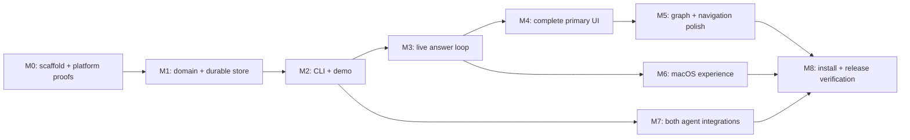

# Implementation roadmap

**Planning complete; implementation not started.** Checkboxes below describe future work. Read [PRODUCT](PRODUCT.md), [ARCHITECTURE](ARCHITECTURE.md), [CONTRACTS](CONTRACTS.md), [DESIGN](DESIGN.md), and [INTEGRATIONS](INTEGRATIONS.md) before changing a contract. Record significant changes in [DECISIONS](../../DECISIONS.md).

## Build sequence

Default execution is one ordered implementation stream. The dependency graph shows where future delegation could be safe; it does not require parallel agents. Complete the core store/command contract before multiple contributors consume it. Each milestone ends in a demonstrable result and a small local commit series. Do not create a remote or publish.

Rough sizing for an experienced engineer using agents: M0 1–2 focused days; M1 2–3; M2 1–2; M3 1–2; M4 3–4; M5 1–2; M6 2–3; M7 2–3; M8 1–2. Total 14–23 focused days before contingency. These are planning estimates, not elapsed-time promises for autonomous runs. Native notification routing and host integration/version differences are the largest uncertainty. Re-estimate after M0 and M3; preserve completion criteria when adjusting sequencing.

## M0 — Scaffold and retire platform uncertainty

**Deliverable:** a minimal packaged app/CLI skeleton, extracted design references, and written proof results. **Depends on:** this plan.

- [ ] **P0.1** Check current official Tauri docs/releases again, scaffold React + TypeScript from the official template, establish workspace/package scripts, pin toolchains and lockfiles. Record macOS deployment target, CPU architecture, host versions, and reference hardware.
- [ ] **P0.2** Extract the mockup ZIP into a reference-only directory with checksums. Map CSS/tokens/components; package font/icon licenses and remove network imports from production assets.
- [ ] **P0.3** Prove a minimal packaged macOS notification opens a named item route, with the window visible, hidden, and app relaunched after a delivered notification. Test denied permission. If the Tauri plugin cannot provide routing, implement the minimal native delegate adapter now.
- [ ] **P0.4** Prove dynamic tray title/count, single-instance launch argument forwarding, window focus, and always-on-top on the target Mac.
- [ ] **P0.5** Exercise Claude persistent local plugin loading and Codex hook discovery/trust using harmless fixed context. Record supported version baseline and subdirectory/trust/reload behavior; do not infer working support from docs alone.
- [ ] **P0.6** Prove the documented WebdriverIO embedded macOS route in a dedicated test build. Verify an ordinary release build excludes the driver plugin/listener. If it is impractical in this environment, choose the permitted mocked-frontend route and record precisely which native checks stay manual.

**Gate:** evidence file records working launch/notification routing, host hook shape and setup paths, and the chosen test driver. Unknowns have concrete outcomes or an implementation fallback. No polished UI work should hide unresolved required platform capabilities.

**Suggested commits:** `chore: scaffold Tauri and Rust workspace`; `test: prove macOS routing and host hooks`; `docs: record platform baselines`.

## M1 — Domain model and durable shared store

**Deliverable:** a platform-independent Rust core with reliable state transitions. **Depends on:** M0.

- [ ] **P1.1** Define Rust DTOs, schema/version handling, all entity relationships, transition commands, and generated TypeScript/JSON Schema. Build canonical model fixtures including normalized explanation and replacement chain.
- [ ] **P1.2** Implement stable-lock read/modify/validate/atomic-write operations, backups, corruption handling, deterministic migrations, operation receipts, and item revision checks.
- [ ] **P1.3** Implement project/session creation, project-local binding, registry reconciliation, root relocation and unavailable-root diagnostics. Ensure registration failures cannot undo a saved session.
- [ ] **P1.4** Implement answers, corrections, recipient-specific fetch/ack, pagination, and protection against closing over a newer answer.
- [ ] **P1.5** Add the failure tests listed below, including actual child processes sharing the same store and fault injection around commit boundaries.

**Gate:** no lost updates in repeatable multi-process tests; every persisted result validates; retries allocate no duplicate item/message/answer; malformed/future-schema files remain unchanged; backup recovery preserves damaged input. Core tests run without Tauri or a graphical session.

**Suggested commits:** `feat(core): define session commands and validation`; `feat(store): add atomic locked persistence`; `feat(core): add answer receipts and recovery`.

## M2 — Agent-friendly CLI and canonical demo

**Deliverable:** a usable CLI that exercises all domain behavior before UI complexity. **Depends on:** M1.

- [ ] **P2.1** Implement command families in CONTRACTS, compact text/JSON, stable errors/exits, contextual help, stdin batch input, and operation ID retries.
- [ ] **P2.2** Make mutation/message backlinks automatic and transactional. Implement topic allocation, parent validation, close/drop/replace/reopen, filtering, explicit session/consumer routing, and diagnostic commands.
- [ ] **P2.3** Implement `demo`, with the exact short-brief scenario plus only documented normalization. Return created session ID and instructions to open it. Repeated demo runs create clearly separate sessions rather than overwriting work.
- [ ] **P2.4** Add CLI integration tests as subprocesses, including quoted text, Unicode, paths with spaces, invalid options, broken stdin, ambiguous sessions, and simultaneous writers.

**Gate:** a shell script can create a topic tree, record its message provenance, answer, fetch/ack, close, replace, and reload the session using only supported commands. `--json` output parses for both success and failure. `doctor` explains a missing configuration without modifying it.

**Suggested commits:** `feat(cli): add domain commands and batch input`; `feat(cli): add answer protocol and demo`; `test(cli): cover routing and structured output`.

## M3 — First complete answer loop in the app

**Deliverable:** a real CLI → file → UI → answer → CLI loop. **Depends on:** M2; reuse M0 shell.

- [ ] **P3.1** Implement narrowly scoped Tauri commands and a typed frontend backend adapter. Add project/session discovery UI, global waiting summaries, snapshot load, directory watching, revision events and reconciliation.
- [ ] **P3.2** Port the essential shell, simple tree, waiting cards, item detail, and answer control with real data. Use shared selectors and independent local draft state.
- [ ] **P3.3** Submit an answer through the core transaction service, show it in Sent, fetch/ack from CLI, and update delivery state live. Keep the main process available when its window is hidden.
- [ ] **P3.4** Test initial subscription races, atomic replacement events, watcher loss, concurrent updates while typing, stale question rejection, answer-submit retry, and switching sessions with drafts.

**Gate:** demo runs in the desktop app; a fresh CLI question appears without refresh; the owner's answer survives restart and is available until acknowledged. An unrelated agent edit cannot erase the answer or typed draft. This is the first usable internal build.

**Suggested commits:** `feat(desktop): add live store bridge`; `feat(ui): implement question and answer loop`.

## M4 — Complete primary UI and visual fidelity

**Deliverable:** the full second-screen reading/answering experience. **Depends on:** M3.

- [ ] **P4.1** Finish Projects, All sessions and session tabs; known-project registration/location; selection, tab close and persistent UI preferences. Use honest host/last-activity labels.
- [ ] **P4.2** Finish tree expansion, active-descendant indicators, full question/outcome rows, selected ancestry, breadcrumb navigation, all badges and replacement links.
- [ ] **P4.3** Finish detail timeline, answer options/consequences, free text, corrections, Sent/Received/Resolved labels, and message/child navigation. Avoid clipping full sentences in the primary tree/detail.
- [ ] **P4.4** Implement search, all status/topic/owner filters, preserved ancestor context, outside-filter reveal, no-results handling, and stable keyboard/focus behavior.
- [ ] **P4.5** Complete system/light/dark appearance, local assets, loading/empty/all-clear/error states, 1000px layout, accessibility, reduced motion, and the development component gallery.
- [ ] **P4.6** Capture the design-state matrix and visually compare against the supplied HTML at 1600 × 960 in both themes. Record deliberate differences from DESIGN, not unexplained drift.

**Gate:** core UI journey passes automated tests; waiting remains visible on every screen; every required state has an inspected screenshot; text, focus and status are readable in both themes. No fake demo-agent timers appear in production.

## M5 — Graph and performance

**Deliverable:** a useful branching overview consistent with tree state. **Depends on:** M4.

- [ ] **P5.1** Implement per-topic SVG graph layout, node/status styling, selected ancestry, replacement arcs, pan/zoom/fit and reveal selected.
- [ ] **P5.2** Synchronize selection, expansion and filtering with the tree/detail. Provide full text through detail; keep every graph action available through normal controls.
- [ ] **P5.3** Measure initial load, answer save, external-update latency and search on 2,000 items/5,000 messages; verify bounds and graceful errors with a larger fixture. Use memoized selectors and only add virtualization where measurements show a need.

**Gate:** graph selection navigates to the same item/detail as tree and queue; no additional persisted graph model; performance measurements meet PRODUCT targets or have a documented fix before release.

## M6 — Native macOS experience

**Deliverable:** the second-screen app behaves like a Mac utility. **Depends on:** M3 and M0 proofs; may follow M5 in the default sequence.

- [ ] **P6.1** Wire global tray count/oldest questions to real sessions, including invalid/unavailable-session indicators and correct project labels.
- [ ] **P6.2** Wire notification transitions, deduplication, burst behavior, privacy preference and click routes to real data; test foreground, hidden window, and quit/relaunch after a delivered notification.
- [ ] **P6.3** Complete `ariadne open` resolution and first/second-instance route handling, missing-app diagnostics, project paths with spaces, and item reveal outside active filters.
- [ ] **P6.4** Complete pin-window control, geometry persistence, hide/quit behavior, monitor removal and wake reconciliation.

**Gate:** packaged app passes the native checklist. Notification denial does not damage answer flow; ordinary metadata/receipt writes do not generate notifications; counts agree with the global queue.

## M7 — Claude Code and Codex, setup and uninstall

**Deliverable:** both agents maintain Ariadne and receive owner answers in real conversations. **Depends on:** M2/M3 and M0 host proofs.

- [ ] **P7.1** Author canonical rules and generate host artifacts. Implement bounded, non-blocking hook adapters, binding/context formatting, pagination hints, manual-fetch fallback, and host-safe errors.
- [ ] **P7.2** Implement project/global setup journals, dry run, managed instruction blocks, plugin resources, Codex hook entry merge, host version/trust diagnostics and duplicate-scope handling.
- [ ] **P7.3** Implement update/uninstall with conflict-aware ownership checks, partial-setup recovery, preservation of unrelated edits and session history.
- [ ] **P7.4** Run the real-host acceptance script in INTEGRATIONS for each host, including restart/resume and a second concurrent conversation. Save redacted proof transcripts/screenshots plus version/config metadata.
- [ ] **P7.5** Verify global installation is inert in an uninitialized folder; project scope does not affect other roots. Prove instruction fallback when Codex hooks are disabled, without claiming automatic hook success.

**Gate:** owner answers in the app reach each host on the next owner message without retyping; recipients remain isolated; setup twice/uninstall leaves unrelated settings intact. Both hosts must pass—one working host is not release completion.

## M8 — Install, hardening and handoff

**Deliverable:** a local release candidate, reproducible install and a usable README. **Depends on:** M5, M6, M7.

- [ ] **P8.1** Implement `make install`/`make uninstall`, dependency/preflight checks, locked release builds, bundle validation, staged replacement, package manifest, PATH diagnostics and rollback.
- [ ] **P8.2** Run bounded repeatability gates: three distinct test-order seeds for store/CLI/UI suites, ten repetitions of the multi-process writer/answer race set, and one final packaged native/host smoke pass. Persist seeds/logs. Fix failures and rerun the affected gate; never use retries to hide flakiness.
- [ ] **P8.3** Check production offline operation, bundled asset availability, CSP/command permissions, absence of driver/network listeners, file containment and release logging.
- [ ] **P8.4** Write README: what Ariadne is; prerequisites; install; demo; setup per host; trust/reload steps; 60-second tour; rules; answer delivery semantics; diagnostics/recovery; uninstall; limitations. Add actual screenshots.
- [ ] **P8.5** From a clean checkout with toolchains installed, run the one-command installation and full required journey. Record versions, OS, CPU and artifact paths. Review all mandatory acceptance rows below.
- [ ] **P8.6** Finish small local commits, update DECISIONS and the implementation status, report limitations/design deviations and the install command. Ask whether to publish only after the local release is ready; do not publish automatically.

**Gate:** all mandatory acceptance criteria have evidence, no unexplained race/flaky failure remains, and README instructions work from the packaged app. Do not call the product complete merely because the demo looks good.

## Test strategy and failure cases

| Layer | Meaningful tests |
| --- | --- |
| Domain | Valid/invalid transitions, cycles, hierarchical allocation, missing references, close requirements, replacement chains, message backlinks, future-schema rejection, size bounds |
| Persistence | Concurrent process app-service/CLI mutations; same-item revision conflict; writers killed before/after rename; lock timeout/release; full disk/permission errors; backup and migration interruption; registry reconciliation |
| Answers | Fetch before ack, repeated ack, hook crashes, correction during closure, recipients in shared sessions, pages/large answers, duplicate operation keys, changed options while typing |
| CLI | Stable JSON/text/exit contracts, stdin batches, special characters, project paths with spaces, ambiguity errors, consistent help and corrective hints |
| Setup | Empty/existing/malformed settings, idempotence, custom Codex home, instruction override, project/global overlap, foreign name collision, edited owned block, partial installation and uninstall |
| UI | Tree/queue/detail/answer/live updates/search/filters/navigation/theme; persistent drafts and invalidation; accessibility; empty/error states; screenshot comparisons |
| Native | Packaged tray, focus/open routing, notifications/denial/click, hide/quit, pin and monitor changes; test automation plugin absent from release |
| Real agents | Claude and Codex end-to-end with scratch projects, next-turn pickup, restart and recipient isolation |

Prefer Rust unit/process tests and React component tests for deterministic logic. Use the currently documented WebdriverIO Tauri service for a small real-app suite if M0 proves it works; use its browser/mock mode for broader UI coverage. Production Ariadne has no network listener; an embedded test driver may run only in an explicit test build. Native OS interaction remains a small manual packaged-app checklist where automation cannot reliably observe it. [Official Tauri test guidance](https://v2.tauri.app/develop/tests/webdriver/)

All tests use dedicated temporary project roots/configuration homes and deterministic clocks/IDs where useful. Never use real agent settings or the owner's project history as test fixtures. Test cleanup owns only those temporary roots. Each test must pass alone and in the seeded suite.

## Requirement-to-evidence map

| Build requirement | Owning milestone | Required evidence |
| --- | --- | --- |
| Tauri 2, Rust CLI, React TS, current templates | M0 | Generated scaffold/version ledger, workspace builds |
| One JSON/session, schema, atomic/concurrent writes | M1 | Validation fixtures + multi-process/fault tests |
| Known projects/sessions | M1/M4 | Registration, unavailable/relocated roots, switching proof |
| Add/update/close/drop/replace/message/list/fetch CLI | M2 | Subprocess contract suite and demo transcript |
| Tree and collapsed closed branches | M4 | UI assertions + screenshots of mixed-status descendants |
| Persistent waiting panel, detail/timeline, inline answers | M3/M4 | Live loop test, queued/receipt/error screenshots |
| Graph, search, filters, keyboard, themes | M4/M5 | Interaction and visual-state matrix |
| Tray count/list, notification click, always-on-top, open | M6 | Packaged native checklist |
| Shared rules, Claude plugin/hook, Codex current support | M0/M7 | Generated parity check + real-host next-turn pickup |
| Setup/global setup/idempotence/uninstall | M7 | Ownership/configuration round-trip fixtures |
| Example demo | M2 | Canonical fixture validated against short design brief |
| One-command install, unsigned-app instructions | M8 | Clean-checkout install/run record |
| Offline/no telemetry/no unexpected settings edits | M7/M8 | Offline bundle check and settings diffs |
| Repeatable suites, README, local meaningful commits | M8 | Seeds/logs, verified README, local history |

## Risks and fixed responses

| Risk | Response / decision point |
| --- | --- |
| Notification plugin displays but cannot route clicks | Native adapter proof in M0; required feature stays in scope |
| Host hook docs differ from installed behavior | Record tested versions; capability diagnostic and documented Codex fallback; Claude minimum version if required |
| Agent follows rules inconsistently | Always-loaded bootstrap, concise batch CLI, real-host checks; be candid that semantic logging depends on agent compliance |
| Answer lost or processed twice | Non-destructive fetch, explicit IDs/ack, retry receipts, closure sequence check; do not promise exactly-once arbitrary external work |
| JSON rewrite grows too slow | Enforce bounds and measure; continue in a new session when full, never silently add SQLite contrary to the prompt |
| Design export includes unrelated features | DESIGN reconciliation table controls scope; preserve mandatory behavior and record visual differences |
| Same-user external edits bypass the lock | Validate reads, retain last good state and backup; explain cooperative-writer guarantee |
| Setup rollback erases user's later edit | Owned blocks/entries and checksum conflict detection, never whole-file restore |

## Starting the next implementation session

Begin at **P0.1**. Read the plan index and decision log, check local Git status, recheck the dated upstream assumptions, then implement M0. Update checkboxes only after their evidence exists. Preserve the original prompts and ZIP. Do not rerun this planning process or replace decided contracts merely because a fresh session starts.
