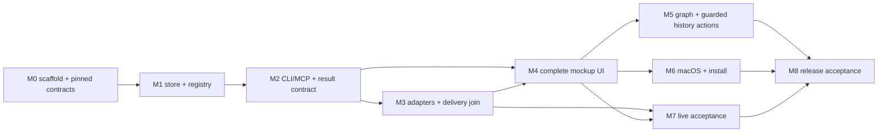

# Implementation roadmap

**Release 1 uses already-running agent sessions.** Claude Mods is the Claude
adapter and the Codex native queue CLI plus read-only daemon history is the
Codex adapter. They deliver messages and report lifecycle; agents use the
versioned Ariadne CLI/MCP domain contract to choose replies, statuses, topics,
and children. A completed host turn is not an item reply or a status change.
Managed launch and provider permission UI are outside this release.

This plan is an execution sequence, not a request for more architecture
research. The current design references below define schemas and algorithms.
If implementation finds a contradiction, record the evidence and update the
authoritative contract and this roadmap together before coding around it.
Organization security guidance was not checked under the owner's explicit
waiver; no project-specific decision is represented as the review tool-approved.

## Fixed implementation rules

- One project-local JSON file per session is authoritative. The global project
  index is rebuildable. App and CLI/MCP writes share the core transaction and
  stable-lock algorithm in [Domain and storage](low-level/DOMAIN_AND_STORAGE.md).
- The desktop app owns dispatch while it is running. It services Claude Mod claims through a private Unix-domain socket and schedules
  Codex adapters after committing input. After
  app quit, do not start new dispatch; an already-running external host session
  continues, and the CLI/MCP can still read and mutate domain state.
- One input may be in flight per binding. Bindings in the same project have
  independent queues and may progress concurrently. Each binding delivers its
  owner's inputs one at a time in FIFO order, with no coalescing.
- Persist each host turn's result by input and attempt. Explicit domain replies
  and tree operations are durable immediately. Advance only when both a
  successful turn completion and a valid committed input result are present,
  regardless of which arrives first. A missing result pauses that binding.
- Persist the complete Ariadne item conversation (owner messages and explicit
  item-targeted replies) and provenance. Do not ingest or persist private host
  transcripts. Temporary host activity is bounded and diagnostic.
- Setup/bootstrap registers a project and explicitly attaches an existing host
  conversation to an Ariadne session and binding. Do not infer a binding from
  the selected tab, recent activity, or PID. Implement bounded, read-only
  discovery/liveness from known host metadata where available; manual binding
  remains the fallback. PID evidence alone never establishes identity or
  liveness. Hooks are optional.
- Keep the provider-neutral adapter boundary easy to extend. Public plugin
  registration and a third executable adapter are deferred beyond this
  personal release; first-party adapters must not require provider branches in
  the domain model, store, or item UI.
- Every code commit runs all required lint and test checks, including
  functional and E2E checks, and maintains at least 80% overall code coverage.
  Coverage is N/A while the repository contains no production application
  code; once production code exists, missing coverage instrumentation or a
  missing coverage result fails the gate. Live billable host sessions run at
  the explicit M7 acceptance milestone, never as a per-commit check.

## Dependency sequence

Work in this order by default. Each milestone has a reviewable artifact and a
small checked commit series and independently reviewed GitHub PRs.

## M0 — Scaffold, design inventory, and version ledger

**Deliverable:** a compiling Tauri 2 / Rust / React + TypeScript skeleton, an
inventory of the supplied mockup states/assets, and exact local toolchain and
host-version records. No product feature work is needed to pass M0.

- **P0.1 — Scaffold safely.** Inspect the repository tree and `git status` before scaffolding. Generate the
  Tauri 2 React + TypeScript template in a fresh staging directory outside the
  repository; never point a scaffold command at this nonempty repository or
  overwrite existing files. Select a concrete generator version before running
  it; do not use `@latest`. Integrate the scaffold into this checkout while
  preserving existing files. Record the exact command and resolved generator
  version.
- Create the Cargo workspace, npm lockfile, formatter/linter/type-check
  scripts, and a clean local build. Use the stable toolchain already installed;
  record exact Rust, Cargo, Node, npm, Tauri CLI/runtime, React, generator,
  package versions, OS, and architecture in
  `docs/planning/evidence/platform-ledger.md`. Save version-command output and
  lockfiles. No framework or SDK selection remains open.
- Record host and machine versions available for the build: macOS release,
  architecture, Claude Code, and Codex. The existing-session transport
  evidence is Claude Code **2.1.287** and Codex **0.160.0**. These are proven
  adapter baselines, not a claim that other versions are compatible. Detect
  unsupported host versions with a clear diagnostic.
- Extract the provided design export as reference material, add a manifest of
  every screen/state/asset and its intended product view, record asset
  licences, and identify any remote dependencies to replace with bundled
  assets. Keep original inputs unchanged.
- Define generated schema/TypeScript drift checks and record the first schema
  and protocol fixture provenance. No protocol field is guessed from prose.
  Follow PROCESS_AND_PROTOCOLS section 6 for the pinned Codex JSON Schema → Rust
  generator, vendored schema hashes and CLI/daemon compatibility manifest.
  Scaffold all three thin app/CLI/MCP entry points in the shared Cargo workspace.
- Package a debug build and confirm the application starts on the target Mac.
  Native features are verified in M6.
- Add repository quality-gate scripts and the commit hook. During planning without application source, report application coverage as N/A;
  the first scaffold application source or root Cargo manifest activates all gates;
  every code commit must pass all maintained-code lint, test, functional and
  E2E checks, and at least 80% overall coverage.

**Gate:** clean checkout builds the scaffold using lockfiles; exact toolchain,
host, OS, architecture, and mockup manifest are recorded; no web/CDN asset is
required at runtime. If a toolchain, network download, or OS permission blocks
this, record the exact missing prerequisite and stop only the affected build
step. Do not change the architecture to work around an environmental block.

## M1 — Durable session core and project registry

**Deliverable:** a Rust core that implements the full versioned session
contract, project registration, binding identity, and concurrent safe writes.

- Implement the domain entities, IDs, limits, validation, transitions,
  revisions, actor scopes, receipts, and canonical demo fixture from
  [Domain and storage](low-level/DOMAIN_AND_STORAGE.md) and
  [API and MCP](low-level/API_AND_MCP.md). Include full item-message/reply records and the
  per-input/per-attempt result state needed by the current result contract.
- Implement one authoritative JSON file per session, a stable sibling lock and
  in-process keyed mutex,
  reread-under-lock transaction, deterministic serialization and atomic
  replacement. App, CLI and MCP all use this service; no writer may edit a
  snapshot directly. Keep ordinary write conflicts and retry behavior clear;
  defer elaborate recovery for exotic corruption, full disks, machine crashes
  and lost-data scenarios.
- Implement project-local metadata and a small rebuildable global project
  index; register/locate/forget roots, reject duplicate project identity, and
  explicitly attach a known host conversation to one binding generation.
  Preserve prior bindings and history when a binding changes. Discovery from
  known metadata is a first-version feature; manual binding remains available.
- Support concurrent app and CLI/MCP writes. Different-item writes must not be
  lost; same-item stale revisions must return a conflict; separate bindings in
  one project must not block each other's logical queues.
- Implement bounded queries and cursors for items, item messages/replies,
  status history, links and backlinks. Persist no private host transcript.

**Gate:** focused core and functional tests cover the canonical session
fixture, schema rejection, concurrent separate-process writes, exact retries,
registry rebuild, duplicate project identity, binding isolation, size limits
and pagination. Exercise ordinary atomic replacement and stale-revision
conflicts. Exotic corruption, full-disk, machine-crash and lost-data recovery
matrices are deferred. Per-commit lint/tests/functional/E2E checks and the 80%
overall coverage threshold apply once production code exists.

## M2 — Domain CLI, MCP, bootstrap, and result contract

**Deliverable:** agents and owners can perform all domain work with the same
core through stable CLI and local stdio MCP interfaces, including the explicit
reply/result handoff.

- Implement CLI commands, compact text and `--json` envelopes, documented exit
  codes, contextual help, stdin batch input, session/project/binding routing,
  setup/doctor/validate, demo, and stable operation-ID retry behavior.
- Implement the MCP `session_read`, `item_messages`, `item_rounds`, `apply`, and adapter
  bootstrap/bind interfaces from [API and MCP](low-level/API_AND_MCP.md).
  The bound adapter supplies identity; model arguments cannot change project,
  session or binding generation.
- Add `reply` operations with target item and full reply text to atomic `apply`.
  Add `input_result` with input ID, attempt ID, outcome, explanation, and
  references to replies/follow-up items. Validate every referenced operation
  committed in the same or an earlier accepted result, and reject cross-binding
  or stale-attempt results. Persist receipts and support exact retries.
- Define the result/completion join: either event order is accepted; only a
  successful host completion plus a valid result seals the attempt and releases
  the next input. A result without successful completion remains open for
  reconciliation. Host completion without result becomes `result_missing`,
  pauses the binding, and never synthesizes a reply from terminal text.
- Add explicit recovery operations to inspect the attempt and choose reviewed
  repair, resend, or skip. Preserve the original input and history; never make
  Resume silently skip a failure. A resend may repeat work and is visibly
  audited.
- Implement the project bootstrap path for an existing session: install or
  select the first-party adapter, register the project, create/select an
  Ariadne session, bind the known host conversation, load canonical agent
  rules, verify the adapter heartbeat/readiness, and show the resulting binding
  in `doctor`. Repeat bootstrap idempotently. Do not start or resume the host.
- Generate agent rules and schemas from their single authored source. Describe
  when to log work, reply to items, set statuses, create children/topics, and
  publish an input result.

**Gate:** CLI and MCP run against the same temporary session and return the
same committed IDs/revisions. A subprocess can add two children atomically,
reply to any item including a closed item, set an allowed agent status, create
a topic, and publish a result. Replayed operations produce no duplicates.
Binding mismatch, result-missing, stale attempt, malformed batch and
operation-ID reuse have stable codes and corrective hints. Bootstrap twice is
idempotent and never launches the host.

## M3 — Existing-session adapters and durable delivery

**Deliverable:** Claude Mods and Codex queue adapters feed one common adapter
contract and dispatch five independent owner inputs through their existing
conversations, with joined results and safe recovery.

- Implement the versioned internal adapter protocol, lifecycle/input event
  schema, checkpoints and deduplication from [Agent adapters](AGENT_ADAPTERS.md).
  Keep its extension boundary provider-neutral; public plugin registration
  and third-party executable proof are deferred.
- Implement the Claude Mods adapter on the proven `$.prompt.submit` path and
  its ordered lifecycle/result events. Implement Codex through the proven
  native queue CLI and read-only daemon history. Pin parser fixtures to Claude
  **2.1.287** and Codex **0.160.0**; unsupported versions fail with actionable
  compatibility errors. Do not add a managed-launch path or permission UI.
- The app owns a private local Unix-domain socket to the adapter/bridge. It
  wakes delivery after a durable commit, maintains one in-flight message per
  binding, and starts the next only after the completion/result join succeeds.
  Multiple bindings in one project can run concurrently. The socket is local,
  permission-restricted, versioned and rejects stale binding generations.
- On app quit, persist queue state and stop initiating delivery. Do not stop or
  interrupt an external host session. On relaunch, reconcile adapter evidence
  before deciding whether a send is retryable, uncertain, or already consumed.
- Keep adapter activity bounded and diagnostic. Persist full item-targeted
  replies through the domain API only; no raw host transcript scraping or
  automatic terminal-summary reply. Implement first-pass read-only discovery
  and liveness from known host metadata; if a host does not expose sufficient
  metadata, report that limitation and retain manual binding. Hooks remain
  optional.

**Gate:** deterministic tests prove five queued inputs create five distinct,
correlated FIFO turns through the adapter contract; busy submissions queue
without loss; different bindings progress independently; completion/result in
both orders joins once; each explicit reply/tree mutation appears immediately;
app quit does not dispatch new work or stop the host; relaunch does not blindly
replay; missing result pauses; exact retries deduplicate. Use captured fixtures
and a fake adapter for this milestone; live/billable host acceptance is
reserved for M7.

## M4 — Complete mockup UI and owner actions

**Deliverable:** production-backed implementation of the supplied mockups,
including all message rounds, item history, and owner actions.

- Build the full project/session rail, global waiting/sent areas, topics/tree,
  item detail, item conversation timeline, answer composer, search/filters,
  graph entry points, empty/loading/stale/error states, themes, keyboard and
  accessibility behavior from the mockup inventory.
- Render every owner message and agent reply as a separate ordered round with
  timestamps/provenance and item links. Support sending a message against any
  item, including a closed item; preserve its status. Owner messages do not
  modify status. Agents may set any status allowed by the domain state machine;
  status changes remain explicit domain operations.
- Support the mockup's owner actions and show their intent and consequences:
  answer/revise an answer, send reopen/drop as queued requests to the agent
  without writing item status, and navigate through descendants, replacements,
  messages and related items. Keep confirmation local to consequential
  actions; do not invent automatic state changes.
- Include project registration/binding and adapter state, queued/sending/
  delivered/result-missing/recovery states. Unknown or stale presence never
  implies that a session is ready.
- Persist drafts, selection, filters, layout and the Later rail flag only in
  local UI preferences. Subscribe before snapshot load, reconcile revisions,
  and preserve drafts, focus and scroll while unrelated updates arrive.

**Gate:** every supplied design state is mapped to an implementation and
compared at the reference viewport and themes. UI acceptance covers five input
rounds, multi-item replies, closed-item messages, owner actions, status edits,
reopen/drop request intents (with no direct owner status write), current-episode
Waiting counts and answered items in Sent, Later rail persistence, stale drafts,
filters, accessible keyboard navigation, external updates and offline history.
A mocked backend can cover deterministic visual/UI paths; all domain writes
still use the real Rust API.

## M5 — Graph and guarded history actions

**Deliverable:** graph and history operations match the restored design scope
without cross-session mutable sharing.

- Implement the deterministic per-topic graph, ancestry/replacement links,
  zoom/pan/fit, viewport culling above 300 nodes and synchronized tree/detail
  selection. Verify crossing edges, off-screen focus and full-bounds Fit on
  the 2,000-node fixture using UI_AND_NATIVE's concrete culling algorithm.
- Archive a topic only when all its items are terminal and no outstanding
  topic input/result/recovery exists. Close a session only when all its items
  are terminal, no unresolved inputs remain and dispatch is paused. Keep
  archived history readable and searchable; no data deletion.
- Continue a topic into another **existing bound session** by previewing a
  provenance-preserving snapshot copy, then committing the copied topic/items
  and queued handoff input atomically in the target session. Keep the source
  topic unchanged and independent; do not create a shared mutable topic or
  silently create/bind another host session. Reject an active target conflict
  or incomplete preview.

**Gate:** graph and tree selection agree. Tests reject archive with any active
topic item or unresolved topic input; reject session close with any active item,
unresolved input, or enabled dispatch binding; archive/close retain history.
Continue
preview and commit preserve source IDs as provenance, allocate new target IDs,
preserve parent/replacement/message context as specified, enqueue exactly one
handoff, and leave source data byte-for-byte semantically unchanged. Target
revision conflict commits nothing.

## M6 — Native macOS behavior and local installation

**Deliverable:** the app behaves as a Mac utility and installs/uninstalls
without deleting project history or rewriting unrelated host configuration.

- Implement the native menu-bar count/list, notifications and click routing,
  single-instance `ariadne open`, focus/reveal route, always-on-top, geometry,
  hide/quit, monitor changes and wake reconciliation.
- Implement idempotent project/global setup and owned-resource uninstall.
  Preserve edited or unrelated settings; never manage provider credentials.
  Keep installation simple and avoid transactional setup journals or
  multiversion rollback machinery. Optional external hooks are auxiliary.
- Implement `make install` and `make uninstall` for this local Mac release,
  with OS/architecture/toolchain preflight, locked builds, a package manifest,
  and unsigned-app instructions. Do not silently edit shell startup files.
  Preserve session and backup history.
- Test packaged app behavior on the recorded host Mac. Record the target macOS
  deployment minimum and tested release versions in the platform ledger.

**Gate:** packaged notification route works in foreground, hidden and cold
launch states; denial does not block answering. Tray counts match the global
waiting panel. Open routes work with project paths containing spaces. Setup
twice is a no-op; uninstall preserves unrelated edits and history. Install
from a clean checkout and uninstall only package-owned files.

## M7 — End-to-end acceptance

**Deliverable:** repeatable release evidence for the full user workflow on both
supported existing-session adapters.

- In disposable projects, complete five queued owner messages through Claude
  and Codex existing sessions. For each, verify exact binding/input/attempt
  correlation, explicit item reply and result, allowed status/topic/child
  changes, and completion/result join. Include owner messages aimed at closed
  items and multi-item agent replies.
- Exercise busy queuing, app quit/relaunch, host disconnect, duplicate adapter
  events, missing result, result before completion, completion before result,
  and explicit repair/resend/skip. Focus on day-to-day recovery behavior.
- Verify binding isolation with two simultaneous host sessions in one project
  and another project; no answer, reply or event crosses a binding generation.
- Record known-metadata discovery/liveness behavior for both hosts, including
  any unsupported metadata as a stated limitation. Verify manual binding still
  works. Never infer liveness from PID alone.

**Gate:** [Verification](low-level/VERIFICATION.md) non-deferred rows pass with
versioned evidence. Both first-party adapters use the same domain API,
ordering, correlation, result and binding semantics. Run live/billable host
acceptance only at this milestone, not on every code commit.

## M8 — Release acceptance and handoff

**Deliverable:** locally installable release candidate, complete evidence
ledger and user-ready README.

- Run the complete deterministic and functional/E2E acceptance suite once,
  then rerun affected gates for fixes. Preserve fixtures, seeds and logs.
- Verify offline project/session history, demo, message/reply browsing and
  owner edits. Verify no private host transcript, credential data, telemetry,
  updater, remote assets or Ariadne network listener ships.
- Build/install from a clean checkout, run the packaged app and acceptance
  journey, then verify package uninstall. Record exact source revision, OS,
  architecture, tool versions and artifact paths.
- Finish meaningful local commits, update `DECISIONS.md`, roadmap checkboxes,
  README and limitations. Publish reviewed repository changes through the autonomous maintainer workflow;
  distribution of a signed public app remains a later decision.

**Gate:** every non-deferred row in the verification ledger is `proved on <version>` with
evidence or clearly marked as a documented environment blocker. No required
flow is claimed complete based only on a transport POC, schema inspection,
mock UI, or happy-path fixture.

## Implementation entry point

Start at **P0.1** and follow M0 through M8 in order. Read [BUILD_HANDOFF](BUILD_HANDOFF.md),
[LOW_LEVEL_DESIGN](LOW_LEVEL_DESIGN.md), [DECISIONS](../../DECISIONS.md), and
the linked low-level specifications. Check local Git status and preserve
unrelated edits. Use the recorded Tauri 2 / Rust / React + TypeScript stack and
the exact M0 lockfile versions. Do not repeat architectural research, revisit
the already proven adapter primitives, or substitute managed launch, hooks,
transcript scraping, or PID-only routing for the specified workflow.
